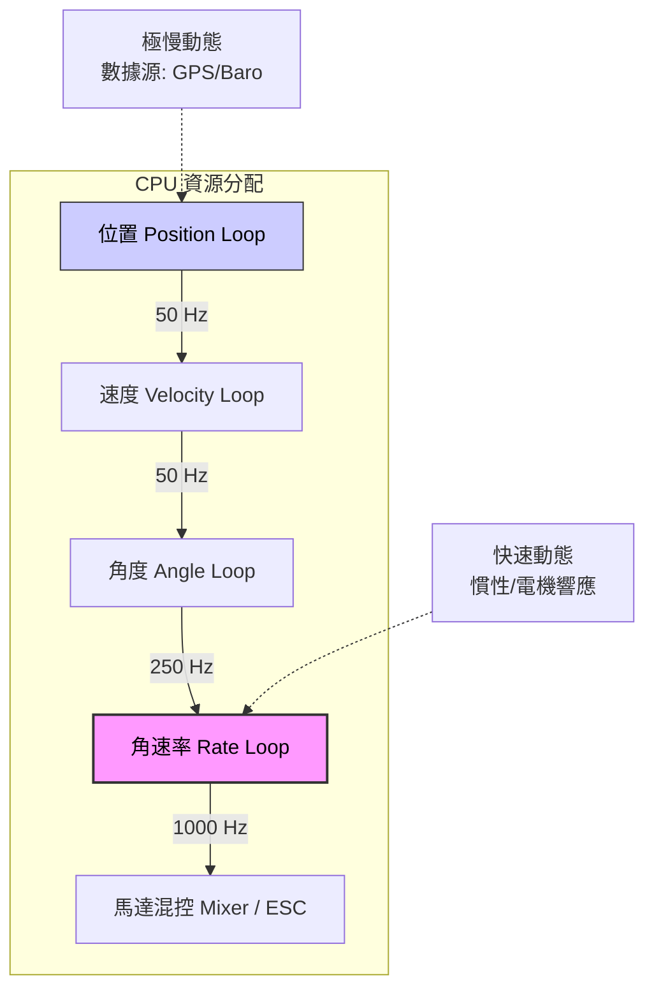
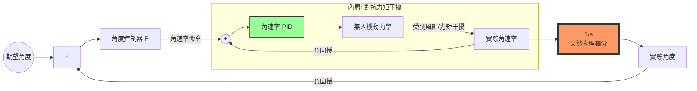
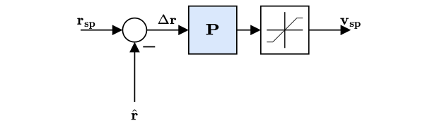
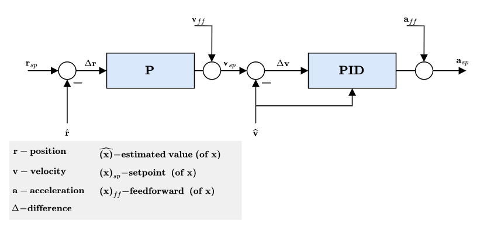

# 飛控與伴隨電腦架構 (FC and Companion Computer)

參考說明: [PX4 Systems Architecture](https://docs.px4.io/main/en/concept/px4_systems_architecture#fc-and-companion-computer)

## 3. 現代無人機通訊數據流 (Modern Data Flow)

| 傳輸路徑 (Path) | 協議與技術 (Protocol/Tech) | 說明 |
| :--- | :--- | :--- |
| **FC 內部** | **uORB** | 飛控內部的訊息交換核心 (Message Bus) |
| **FC $\leftrightarrow$ 伴隨電腦** | **XRCE-DDS / ROS 2** | `PX4 (uORB)` $\to$ `DDS Bridge` $\to$ `ROS 2 Topics` 透過 uXRCE-DDS Client/Agent 橋接 |
| **伴隨電腦 $\leftrightarrow$ GCS (地面站)** | **MAVLink** (控制) **WebRTC / RTSP** (影像) | 地面站主要使用 MAVLink，影像走專用串流協議 |
| **伴隨電腦 $\leftrightarrow$ Cloud (雲端)** | **MAVLink / Zenoh** **WebRTC / RTSP** | Zenoh 適合更具彈性的雲端與邊緣通訊 |

- uORB : micro Object Request Broker 微型物件請求代理
- DDS : Data Distribution Service 資料分發服務
- MAVLink : Micro Air Vehicle Link 微型飛行器通訊協定
- XRCE-DDS : eXtensible Remote Communications for Embedded Devices - Data Distribution Service 嵌入式設備可擴展通訊資料分發服務

## 4. 行業架構選型對比 (Architecture Strategy)

| 類型 | 代表案例 | 硬體平台 | 通訊核心 | 特點與適用場景 |
| :--- | :--- | :--- | :--- | :--- |
| **AI 邊緣運算型** | **Anduril** | **NVIDIA Jetson** | **Zenoh** | **高智能、自動目標識別** 適合高頻寬、低延遲的機載 AI 處理與多機協同。 |
| **標準化長續航型** | **Auterion** | **Qualcomm** | **MAVLink** | **4G/5G 遠程圖傳、標準化** 適合依賴現有生態系、長距離巡檢與物流應用。 |

---

# [PX4 Architectural Overview](https://docs.px4.io/main/en/concept/architecture#px4-architectural-overview)

PX4 由兩層組成： 
- flight stack, 是一個估計和飛行控制系統， 
- middleware, 是一個通用機器人層，可以支援任何類型的自主機器人，提供內部/外部通訊和硬體整合。

tips: 
- shell ' top '查看正在執行的模組
- <module_name> start/stop
- [Modules & Commands Reference](https://docs.px4.io/main/en/modules/modules_main)

Modules之間透過名為 [uORB](https://docs.px4.io/main/en/middleware/uorb) 的發布/訂閱訊息匯流排進行通訊
- 該系統是響應式的——它是非同步的，當有新資料可用時會立即更新
- 系統元件可以以線程安全的方式從任何位置使用資料

## Flight Stack 

controller variable三種狀態
- a setpoint and a measurement or estimated state
  - Measurement 來自感測器
  - estimated 來自EKF
- flight stack control迴路分開看, ie. setpoint = 10m, measurement = 5m, error = 5m, 
  - controller = position controller
  - input = position & atti estimation + nav + rc
  - output = atti & rate controller

## Middleware
包含
- device drivers for embedded sensors
- communication with the external world (companion computer, GCS, etc.) and the uORB publish-subscribe message bus.
- [sim layer](https://docs.px4.io/main/en/simulation/),包含 SITL, HITL, etc.
### 通訊協議比較 (Communication Protocols)

| 特性 | UART (序列通訊) | CAN BUS (實體匯流排) | uORB (軟體訊息中心) |
| :--- | :--- | :--- | :--- |
| **比喻** | 兩個人打電話 | 全體員工大會（配麥克風） | 公司的內部佈告欄 |
| **通訊對象** | 1 對 1 | 多對多（硬體層面） | 多對多（軟體模組間） |
| **資料識別** | 無（只管收字元） | 訊息 ID（如：馬達轉速） | 主題名稱（如：vehicle_status） |
| **衝突處理** | 會亂碼（碰撞） | 自動仲裁（高優先級優先） | 由作業系統調度排隊 |
| **硬體連線** | 線路混亂 (Star/Direct) | 極簡（一對絞線走天下） | 無（內部記憶體交換） |

### 用「網路七層」概念理解

| 層級 (Layer) | 負責對象 | 對應技術 |
| :--- | :--- | :--- |
| **應用層 (Application)** | 飛行邏輯、路徑規劃 | PX4 Modules |
| **中介軟體 (Middleware)** | 內部訊息交換 | uORB |
| **傳輸層 (Transport)** | 資料打包格式 | UAVCAN (Cyphal) |
| **物理層 (Physical)** | 實際的電壓訊號、線路 | CAN BUS 介面 / 線材 |

## Sample data & Update Rates
- IMU取樣1kHz, 積分後以250Hz發布給navigator
- uorb top 指令即時[檢查](https://docs.px4.io/main/en/middleware/uorb)系統上的消息更新速率

## Runtime Environment 
- 模組間通訊（使用 uORB ）基於共享記憶體。整個 PX4 中間件運行在同一個位址空間中，即所有模組共享記憶體。
- 此系統設計使得只需付出最少的努力即可在單獨的位址空間中運行每個模組（需要更改的部分包括 uORB 、 parameter interface 、 dataman 和 perf

PX4 中模組有兩種執行方式：

| 特性 | Tasks (獨立任務) | Work Queue Tasks (工作佇列任務) |
| :--- | :--- | :--- |
| **ie.** | 要「決策」, SLAM, 重型運算, LOG | 只是「接收」數據, IMU, Navigator, Attitude controller |
| **資源與堆疊** | 擁有獨立的 stack 與優先權 | 共享相同的 stack 與執行緒優先權 |
| **記憶體佔用** | 較高 (每個任務獨立) | 較低 (共享資源) |
| **上下文切換** | 較頻繁 | 較少 (更有效率) |
| **限制** | 可執行 Blocking IO、Sleep | **不可** Sleep、Poll 或 Blocking IO |
| **適用場景** | 重型運算、需長時間運行或等待的任務 | 輕量級、週期性、事件驅動的各類驅動程式 |

### Work Queue 機制說明
- **協作式多工 (Co-operative behavior)**: 所有工作佇列任務必須互相協作，不能互相干擾。
- **排程 (Scheduling)**: 可透過指定未來的固定時間或 uORB topic update callback 進行調度。
- **多重佇列**: 一個系統中可以有多個工作佇列，每個佇列可運行多個任務。

### 監控與指令 (Monitoring)
> **INFO**: 正在工作佇列中執行的任務**不會**顯示在 `top` 指令中。

- `top`: 只能看到工作佇列本身 (例如 `wq:lp_default`)。
- `work_queue status`: 使用此指令來顯示所有活動的工作佇列項目。

---

## Controller Diagrams 
- [核心術語](https://docs.px4.io/main/en/contribute/notation#terminology)
    - 粗體變數表示向量或矩陣，非粗體變數表示標量

### 1. 空氣動力學 (Aerodynamics)
決定 FW (固定翼) 飛行穩定性的關鍵指標：
- **AOA (Angle of Attack / 攻角 $\alpha$)**: 翼弦線與相對風向之間的夾角。攻角過大會導致「失速」。
- **AOS (Angle of Sideslip / 側滑角 $\beta$)**: 機身中心線與相對風向的側向夾角 (即飛機是否「橫著飛」)。

### 2. 座標系統 (Coordinate Systems)

| 縮寫 | 全稱 | 參考基準 | 軸向說明 |
| :--- | :--- | :--- | :--- |
| **FRD** | Front-Right-Down | 機身 (Body) | **X 朝前**、**Y 朝右**、**Z 朝下**。感測器計）。 |
| **NED** | North-East-Down | 地球 (World) | **X 朝北**、**Y 朝東**、**Z 朝地心**。 GPS 定位與導航。 |

> 💡 **小提醒**: 在這些系統中，**Z 軸向下為正**。這意味著如果無人機上升 (Altitude 增加)，它的 Z 軸座標數值實際上是在 **「減小」** (變負)。

**控制邏輯**:
*   **PID**: 最基礎的控制演算法。透過 比例 (P)、積分 (I) 與 微分 (D) 來修正飛行誤差。
*   **MCPC (MultiCopter Position Controller)**: 負責控制多旋翼「位置」的模組。
*   **MPC (Model Predictive Control)**: SLAM, Path Planning, 一種更進階的控制方式（模型預測控制），PX4 在某些高階路徑規劃中會用到。   

### Symbols

#### 座標與運動學 (Coordinates & Kinematics)
| 變數 (Variable) | 描述 (Description) |
| :--- | :--- |
| $x, y, z$ | 沿 x, y, z 軸的位移 (Translation along coordinate axis)。 |
| $\boldsymbol{\mathrm{r}}$ | Position vector: $\boldsymbol{\mathrm{r}} = [x \quad y \quad z]^{T}$ |
| $\boldsymbol{\mathrm{v}}$ | Velocity vector: $\boldsymbol{\mathrm{v}} = \boldsymbol{\mathrm{\dot{r}}}$ |
| $\boldsymbol{\mathrm{a}}$ | Acceleration vector: $\boldsymbol{\mathrm{a}} = \boldsymbol{\mathrm{\dot{v}}} = \boldsymbol{\mathrm{\ddot{r}}}$ |
| $\phi, \theta, \psi$ | Euler angles: $\phi$ roll (=Bank), $\theta$ pitch, $\psi$ yaw(=Heading) |
| $\Psi$ | Attitude vector: $\Psi = [\phi \quad \theta \quad \psi]^T$ |
| $p, q, r$ | Angular rates around body axis. |
| $\boldsymbol{\omega}^b$ | Angular rate vector in body frame: $\boldsymbol{\omega}^b = [p \quad q \quad r]^T$ |
| $\boldsymbol{\mathrm{q}}$ | 四元數的向量部分 (Vector part of Quaternion)。 |
| $\boldsymbol{\mathrm{\tilde{q}}}$ | 哈密頓姿態四元數 (Hamiltonian attitude quaternion)。 |
| $\boldsymbol{\mathrm{R}}_\ell^b$ | 旋轉矩陣 (Rotation matrix): 將向量從 $\ell$ 座標系轉至 $b$ 座標系 ($\boldsymbol{\mathrm{v}}^b = \boldsymbol{\mathrm{R}}_\ell^b \boldsymbol{\mathrm{v}}^\ell$)。 |
| $\boldsymbol{\mathrm{x}}$ | 通用狀態向量 (General state vector)。 |

#### 力與力矩 (Forces & Moments)
| 變數 (Variable) | 描述 (Description) |
| :--- | :--- |
| $X, Y, Z$ | 沿 x, y, z 軸的受力 (Forces along coordinate axis)。 |
| $\boldsymbol{\mathrm{F}}$ | Force vector: $\boldsymbol{\mathrm{F}}= [X \quad Y \quad Z]^T$ |
| $l, m, n$ | 繞 x, y, z 軸的力矩 (Moments around coordinate axis)。 |
| $\boldsymbol{\mathrm{M}}$ | 力矩向量 (Moment vector): $\boldsymbol{\mathrm{M}} = [l \quad m \quad n]^T$ |
| $g$ | 重力加速度 (Gravity)。 |

#### 空氣動力與氣流 (Aerodynamics & Wind)
| 變數 (Variable) | 描述 (Description) |
| :--- | :--- |
| $\alpha$ | 攻角 (Angle of attack, AOA)。 |
| $\beta$ | 側滑角 (Angle of sideslip, AOS)。 |
| $L$ | 升力 (Lift force)。 |
| $D$ | 阻力 (Drag force)。 |
| $C$ | 側風力 (Cross-wind force)。 |
| $w$ | 風速 (Wind velocity)。 |
| $M$ | 馬赫數 (Mach number)。在縮比模型飛機中通常可忽略。 |

#### 機體幾何與控制 (Geometry & Control)
| 變數 (Variable) | 描述 (Description) |
| :--- | :--- |
| $b$ | 翼展 (Wing span, 翼尖到翼尖的距離)。 |
| $S$ | 機翼面積 (Wing area)。 |
| $c$ | 翼弦長 (Wing chord length)。 |
| $AR$ | 展弦比 (Aspect ratio): $AR = b^2/S$ |
| $\Lambda$ | 前緣後掠角 (Leading-edge sweep angle)。 |
| $\lambda$ | 梢根比 (Taper ratio): $\lambda = c_{tip}/c_{root}$ |
| $\delta$ | 氣動控制面偏轉角 (Control surface deflection)。正偏轉產生負力矩。 |

---

### 3. 控制架構 (Control Architecture)
Multicopter Control Architecture

#### [discussion about controller PID, update rate](https://discuss.px4.io/t/multicopter-control-architecture-design-choices/31815)

這是一份針對自動化工程背景整理的重點筆記。我們從**頻寬設計（Bandwidth & Sampling）**與**控制架構（Topology）**兩個核心面向，解析為何無人機控制採用這種設計。

---

### 1. 頻率選擇：時間尺度分離原則 (Time Scale Separation)

在串級控制（Cascaded Control）中，內層迴路的頻寬必須遠高於外層迴路，以確保內層能視為「即時」響應外層的命令。

#### **為什麼角速率（Rate Loop）需要 1000Hz？**
*   **關鍵字：** `Fast Dynamics` (快速動力學), `Phase Lag` (相位延遲), `Loop Gain` (迴路增益)
*   **物理特性：** 角速率直接受電機扭力影響。無人機的慣性小、電機響應極快（時間常數 $\tau < 0.05s$）。
*   **控制需求：** 這是系統的最內層。如果採樣率過低，數位控制帶來的延遲（Delay）會造成顯著的**相位滯後（Phase Lag）**，這會限制我們可以設定的**迴路增益（Loop Gain）**。增益不夠高，飛機就會晃動或失穩。
*   **結論：** 為了維持高頻寬與高穩定性，必須「快」（如 1kHz）。

#### **為什麼位置/角度（Position/Angle Loop）只需 50-250Hz？**
*   **關鍵字：** `Slow Dynamics` (慢速動力學), `Estimator` (估測器), `CPU Efficiency` (運算效率)
*   **物理特性：** 這是外層迴路。要改變位置或角度，必須先改變角速率，再經過積分累積物理位移。這個過程相對緩慢（慣性大）。
*   **系統限制：** 位置與姿態數據來自**狀態估測器（如 EKF）**。以 1kHz 運行 EKF 極度消耗 CPU，且感測器（如 GPS、氣壓計）本身的更新率本來就低（GPS 通常僅 5-10Hz）。
*   **結論：** 跑太快沒有物理意義（看不到區別），只會浪費 CPU。50Hz 已足以涵蓋位置變化的動態。

#### **圖示：頻率與動態分層**

---

### 2. 控制器架構：為何採用 P-PID？

針對無人機姿態控制，標準架構通常是 **外層 P 控制器** 串接 **內層 PID 控制器**。

#### **內層（角速率）為何需要 I (積分器)？**
*   **關鍵字：** `Disturbance Rejection` (抗干擾), `Torque/Force` (力矩/力)
*   **物理意義：** 積分項（Integrator）的主要作用是**消除穩態誤差**並對抗**外部擾動**。
*   **場景：** 當風（Wind）吹過或機體重心不穩時，會產生額外的力矩（Torque）。若只有 PD 控制，系統會因為需要持續輸出對抗力矩而產生穩態誤差（飛機會歪一邊）。加上 I，控制器會自動累積誤差，輸出對抗力矩，確保角速率誤差歸零。

#### **外層（角度）為何只需要 P (比例)？**
*   **關鍵字：** `Type 1 System` (一型系統), `Natural Integrator` (天然積分器)
*   **自動化原理：**
    *   物理上，角速率（$\omega$）積分後就是角度（$\theta$）。即 $\theta = \int \omega \, dt$。
    *   這意味著，**被控對象（Plant）本身已經包含一個積分環節**（即 $\frac{1}{s}$）。這在控制理論中稱為 **Type 1 System（一型系統）**。
    *   對於一型系統，針對階躍輸入（Step Input，例如使用者想要維持 10 度傾角），純 P 控制器就能保證穩態誤差為零。
*   **邏輯推導：**
    1.  假設內層（PID）工作完美，角速率沒有誤差。
    2.  如果角度有誤差（$Error_{\theta} \neq 0$），P 控制器會輸出一個非零的角速率命令（$\omega_{cmd}$）。
    3.  內層執行這個 $\omega_{cmd}$，機體轉動，角度誤差隨之減小。
    4.  只要還有角度誤差，就會有角速率命令；直到角度誤差為零，角速率命令才為零，機體停止轉動。
    5.  **結論：** 不需要軟體積分器，物理積分器已經解決了穩態誤差。若在外層強加 I，反而引入額外相位滯後，導致震盪（Overshoot）。

#### **什麼時候外層才需要 I？**
*   只有在追蹤**斜坡訊號（Ramp Input）**（例如：要求飛機以恆定速度持續改變角度）時，Type 1 系統才會有穩態誤差，此時才需要額外的積分器。但在一般定點或姿態保持中，P 已足夠。

#### **圖示：P-PID 架構中的天然積分器**

### 總結重點 (Takeaway)

1.  **頻率差異：** 是為了配合**物理慣性**（內快外慢）與**運算資源**（節省 CPU）的妥協。
2.  **內層 PID：** 用積分器（I）來硬扛風阻與力矩干擾。
3.  **外層 P：** 利用物理上的 $\text{Rate} \to \text{Angle}$ 轉換（ $\frac{1}{s}$）來消除誤差，不需要額外的 I(積分)

---

Multicopter Angular Rate Controller

Multicopter Attitude Controller

Multicopter Acceleration to Thrust and Attitude Setpoint Conversion
- PID controller to stabilise velocity. Commands an acceleration.
- The integrator includes an anti-reset windup (ARW) using a clamping method.
- The commanded acceleration is NOT saturated - a saturation will be applied to the converted thrust setpoints in combination with the maximum tilt angle.
- Horizontal gains set via parameter MPC_XY_VEL_P_ACC, MPC_XY_VEL_I_ACC and MPC_XY_VEL_D_ACC.
- Vertical gains set via parameter MPC_Z_VEL_P_ACC, MPC_Z_VEL_I_ACC and MPC_Z_VEL_D_ACC.

Multicopter Position Controller

Combined Position and Velocity Controller Diagram
