# 飛控與伴隨電腦架構 (FC and Companion Computer)

參考說明: [PX4 Systems Architecture](https://docs.px4.io/main/en/concept/px4_systems_architecture#fc-and-companion-computer)

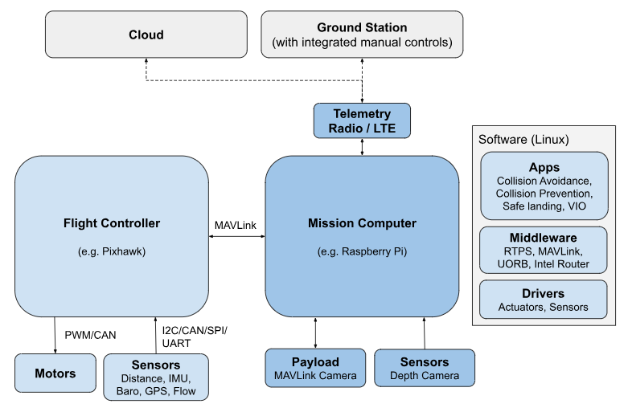

## 3. 現代無人機通訊數據流 (Modern Data Flow)

| 傳輸路徑 (Path) | 協議與技術 (Protocol/Tech) | 說明 |
| :--- | :--- | :--- |
| **FC 內部** | **uORB** | 飛控內部的訊息交換核心 (Message Bus) |
| **FC $\leftrightarrow$ 伴隨電腦** | **XRCE-DDS / ROS 2** | `PX4 (uORB)` $\to$ `DDS Bridge` $\to$ `ROS 2 Topics` 透過 uXRCE-DDS Client/Agent 橋接 |
| **伴隨電腦 $\leftrightarrow$ GCS (地面站)** | **MAVLink** (控制) **WebRTC / RTSP** (影像) | 地面站主要使用 MAVLink，影像走專用串流協議 |
| **伴隨電腦 $\leftrightarrow$ Cloud (雲端)** | **MAVLink / Zenoh** **WebRTC / RTSP** | Zenoh 適合更具彈性的雲端與邊緣通訊 |

- uORB : micro Object Request Broker 微型物件請求代理
- DDS : Data Distribution Service 資料分發服務
- MAVLink : Micro Air Vehicle Link 微型飛行器通訊協定
- XRCE-DDS : eXtensible Remote Communications for Embedded Devices - Data Distribution Service 嵌入式設備可擴展通訊資料分發服務

## 4. 行業架構選型對比 (Architecture Strategy)

| 類型 | 代表案例 | 硬體平台 | 通訊核心 | 特點與適用場景 |
| :--- | :--- | :--- | :--- | :--- |
| **AI 邊緣運算型** | **Anduril** | **NVIDIA Jetson** | **Zenoh** | **高智能、自動目標識別** 適合高頻寬、低延遲的機載 AI 處理與多機協同。 |
| **標準化長續航型** | **Auterion** | **Qualcomm** | **MAVLink** | **4G/5G 遠程圖傳、標準化** 適合依賴現有生態系、長距離巡檢與物流應用。 |

---

# [PX4 Architectural Overview](https://docs.px4.io/main/en/concept/architecture#px4-architectural-overview)

PX4 由兩層組成： 
- flight stack, 是一個估計和飛行控制系統， 
- middleware, 是一個通用機器人層，可以支援任何類型的自主機器人，提供內部/外部通訊和硬體整合。

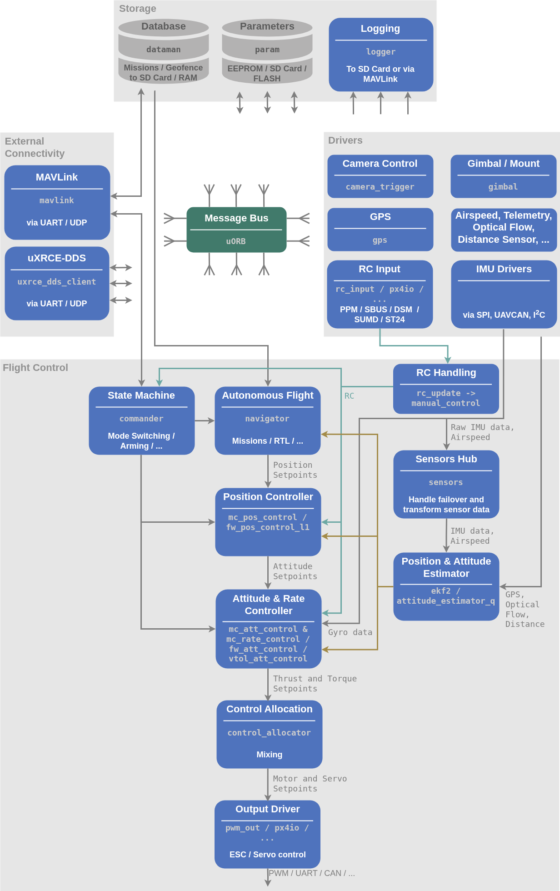

tips: 
- shell ' top '查看正在執行的模組
- <module_name> start/stop
- [Modules & Commands Reference](https://docs.px4.io/main/en/modules/modules_main)

Modules之間透過名為 [uORB](https://docs.px4.io/main/en/middleware/uorb) 的發布/訂閱訊息匯流排進行通訊
- 該系統是響應式的——它是非同步的，當有新資料可用時會立即更新
- 系統元件可以以線程安全的方式從任何位置使用資料

## Flight Stack 
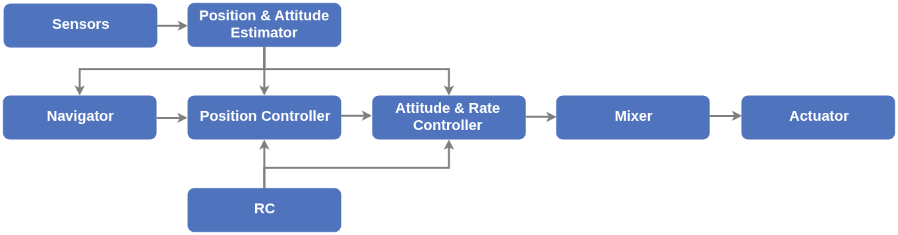

controller variable三種狀態
- a setpoint and a measurement or estimated state
  - Measurement 來自感測器
  - estimated 來自EKF
- flight stack control迴路分開看, ie. setpoint = 10m, measurement = 5m, error = 5m, 
  - controller = position controller
  - input = position & atti estimation + nav + rc
  - output = atti & rate controller

## Middleware
包含
- device drivers for embedded sensors
- communication with the external world (companion computer, GCS, etc.) and the uORB publish-subscribe message bus.
- [sim layer](https://docs.px4.io/main/en/simulation/),包含 SITL, HITL, etc.
### 通訊協議比較 (Communication Protocols)

| 特性 | UART (序列通訊) | CAN BUS (實體匯流排) | uORB (軟體訊息中心) |
| :--- | :--- | :--- | :--- |
| **比喻** | 兩個人打電話 | 全體員工大會（配麥克風） | 公司的內部佈告欄 |
| **通訊對象** | 1 對 1 | 多對多（硬體層面） | 多對多（軟體模組間） |
| **資料識別** | 無（只管收字元） | 訊息 ID（如：馬達轉速） | 主題名稱（如：vehicle_status） |
| **衝突處理** | 會亂碼（碰撞） | 自動仲裁（高優先級優先） | 由作業系統調度排隊 |
| **硬體連線** | 線路混亂 (Star/Direct) | 極簡（一對絞線走天下） | 無（內部記憶體交換） |

### 用「網路七層」概念理解

| 層級 (Layer) | 負責對象 | 對應技術 |
| :--- | :--- | :--- |
| **應用層 (Application)** | 飛行邏輯、路徑規劃 | PX4 Modules |
| **中介軟體 (Middleware)** | 內部訊息交換 | uORB |
| **傳輸層 (Transport)** | 資料打包格式 | UAVCAN (Cyphal) |
| **物理層 (Physical)** | 實際的電壓訊號、線路 | CAN BUS 介面 / 線材 |

## Sample data & Update Rates
- IMU取樣1kHz, 積分後以250Hz發布給navigator
- uorb top 指令即時[檢查](https://docs.px4.io/main/en/middleware/uorb)系統上的消息更新速率

## Runtime Environment 
- 模組間通訊（使用 uORB ）基於共享記憶體。整個 PX4 中間件運行在同一個位址空間中，即所有模組共享記憶體。
- 此系統設計使得只需付出最少的努力即可在單獨的位址空間中運行每個模組（需要更改的部分包括 uORB 、 parameter interface 、 dataman 和 perf

PX4 中模組有兩種執行方式：

| 特性 | Tasks (獨立任務) | Work Queue Tasks (工作佇列任務) |
| :--- | :--- | :--- |
| **ie.** | 要「決策」, SLAM, 重型運算, LOG | 只是「接收」數據, IMU, Navigator, Attitude controller |
| **資源與堆疊** | 擁有獨立的 stack 與優先權 | 共享相同的 stack 與執行緒優先權 |
| **記憶體佔用** | 較高 (每個任務獨立) | 較低 (共享資源) |
| **上下文切換** | 較頻繁 | 較少 (更有效率) |
| **限制** | 可執行 Blocking IO、Sleep | **不可** Sleep、Poll 或 Blocking IO |
| **適用場景** | 重型運算、需長時間運行或等待的任務 | 輕量級、週期性、事件驅動的各類驅動程式 |

### Work Queue 機制說明
- **協作式多工 (Co-operative behavior)**: 所有工作佇列任務必須互相協作，不能互相干擾。
- **排程 (Scheduling)**: 可透過指定未來的固定時間或 uORB topic update callback 進行調度。
- **多重佇列**: 一個系統中可以有多個工作佇列，每個佇列可運行多個任務。

### 監控與指令 (Monitoring)
> **INFO**: 正在工作佇列中執行的任務**不會**顯示在 `top` 指令中。

- `top`: 只能看到工作佇列本身 (例如 `wq:lp_default`)。
- `work_queue status`: 使用此指令來顯示所有活動的工作佇列項目。

---

## Controller Diagrams 
- [核心術語](https://docs.px4.io/main/en/contribute/notation#terminology)
    - 粗體變數表示向量或矩陣，非粗體變數表示標量

### 1. 空氣動力學 (Aerodynamics)
決定 FW (固定翼) 飛行穩定性的關鍵指標：
- **AOA (Angle of Attack / 攻角 $\alpha$)**: 翼弦線與相對風向之間的夾角。攻角過大會導致「失速」。
- **AOS (Angle of Sideslip / 側滑角 $\beta$)**: 機身中心線與相對風向的側向夾角 (即飛機是否「橫著飛」)。

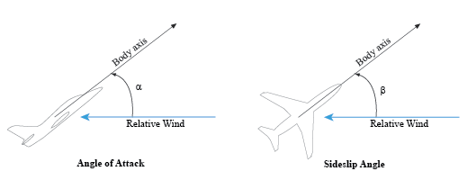

### 2. 座標系統 (Coordinate Systems)
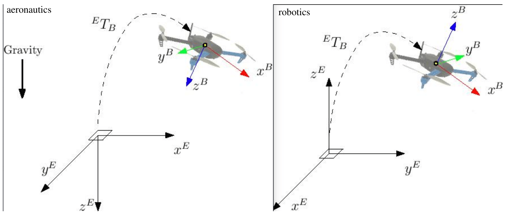
| 縮寫 | 全稱 | 參考基準 | 軸向說明 |
| :--- | :--- | :--- | :--- |
| **FRD** | Front-Right-Down | 機身 (Body) | **X 朝前**、**Y 朝右**、**Z 朝下**。感測器計）。 |
| **NED** | North-East-Down | 地球 (World) | **X 朝北**、**Y 朝東**、**Z 朝地心**。 GPS 定位與導航。 |

> 💡 **小提醒**: 在這些系統中，**Z 軸向下為正**。這意味著如果無人機上升 (Altitude 增加)，它的 Z 軸座標數值實際上是在 **「減小」** (變負)。

**控制邏輯**:
*   **PID**: 最基礎的控制演算法。透過 比例 (P)、積分 (I) 與 微分 (D) 來修正飛行誤差。
*   **MCPC (MultiCopter Position Controller)**: 負責控制多旋翼「位置」的模組。
*   **MPC (Model Predictive Control)**: SLAM, Path Planning, 一種更進階的控制方式（模型預測控制），PX4 在某些高階路徑規劃中會用到。   

### Symbols

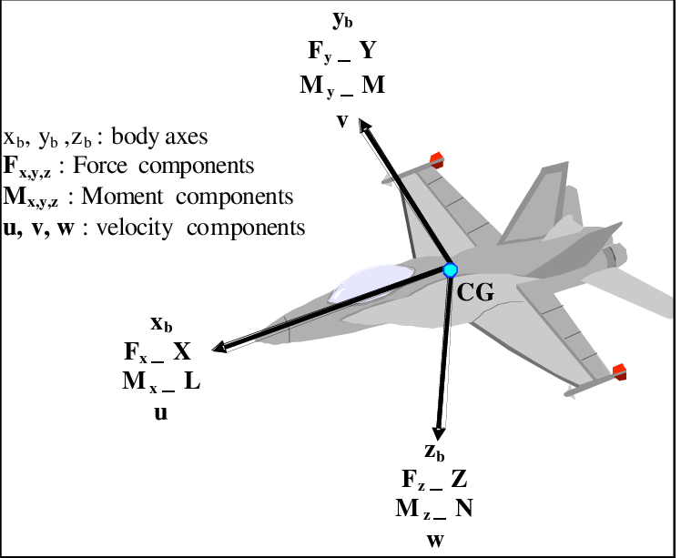

#### 座標與運動學 (Coordinates & Kinematics)
| 變數 (Variable) | 描述 (Description) |
| :--- | :--- |
| $x, y, z$ | 沿 x, y, z 軸的位移 (Translation along coordinate axis)。 |
| $\boldsymbol{\mathrm{r}}$ | Position vector: $\boldsymbol{\mathrm{r}} = [x \quad y \quad z]^{T}$ |
| $\boldsymbol{\mathrm{v}}$ | Velocity vector: $\boldsymbol{\mathrm{v}} = \boldsymbol{\mathrm{\dot{r}}}$ |
| $\boldsymbol{\mathrm{a}}$ | Acceleration vector: $\boldsymbol{\mathrm{a}} = \boldsymbol{\mathrm{\dot{v}}} = \boldsymbol{\mathrm{\ddot{r}}}$ |
| $\phi, \theta, \psi$ | Euler angles: $\phi$ roll (=Bank), $\theta$ pitch, $\psi$ yaw(=Heading) |
| $\Psi$ | Attitude vector: $\Psi = [\phi \quad \theta \quad \psi]^T$ |
| $p, q, r$ | Angular rates around body axis. |
| $\boldsymbol{\omega}^b$ | Angular rate vector in body frame: $\boldsymbol{\omega}^b = [p \quad q \quad r]^T$ |
| $\boldsymbol{\mathrm{q}}$ | 四元數的向量部分 (Vector part of Quaternion)。 |
| $\boldsymbol{\mathrm{\tilde{q}}}$ | 哈密頓姿態四元數 (Hamiltonian attitude quaternion)。 |
| $\boldsymbol{\mathrm{R}}_\ell^b$ | 旋轉矩陣 (Rotation matrix): 將向量從 $\ell$ 座標系轉至 $b$ 座標系 ($\boldsymbol{\mathrm{v}}^b = \boldsymbol{\mathrm{R}}_\ell^b \boldsymbol{\mathrm{v}}^\ell$)。 |
| $\boldsymbol{\mathrm{x}}$ | 通用狀態向量 (General state vector)。 |

#### 力與力矩 (Forces & Moments)
| 變數 (Variable) | 描述 (Description) |
| :--- | :--- |
| $X, Y, Z$ | 沿 x, y, z 軸的受力 (Forces along coordinate axis)。 |
| $\boldsymbol{\mathrm{F}}$ | Force vector: $\boldsymbol{\mathrm{F}}= [X \quad Y \quad Z]^T$ |
| $l, m, n$ | 繞 x, y, z 軸的力矩 (Moments around coordinate axis)。 |
| $\boldsymbol{\mathrm{M}}$ | 力矩向量 (Moment vector): $\boldsymbol{\mathrm{M}} = [l \quad m \quad n]^T$ |
| $g$ | 重力加速度 (Gravity)。 |

#### 空氣動力與氣流 (Aerodynamics & Wind)
| 變數 (Variable) | 描述 (Description) |
| :--- | :--- |
| $\alpha$ | 攻角 (Angle of attack, AOA)。 |
| $\beta$ | 側滑角 (Angle of sideslip, AOS)。 |
| $L$ | 升力 (Lift force)。 |
| $D$ | 阻力 (Drag force)。 |
| $C$ | 側風力 (Cross-wind force)。 |
| $w$ | 風速 (Wind velocity)。 |
| $M$ | 馬赫數 (Mach number)。在縮比模型飛機中通常可忽略。 |

#### 機體幾何與控制 (Geometry & Control)
| 變數 (Variable) | 描述 (Description) |
| :--- | :--- |
| $b$ | 翼展 (Wing span, 翼尖到翼尖的距離)。 |
| $S$ | 機翼面積 (Wing area)。 |
| $c$ | 翼弦長 (Wing chord length)。 |
| $AR$ | 展弦比 (Aspect ratio): $AR = b^2/S$ |
| $\Lambda$ | 前緣後掠角 (Leading-edge sweep angle)。 |
| $\lambda$ | 梢根比 (Taper ratio): $\lambda = c_{tip}/c_{root}$ |
| $\delta$ | 氣動控制面偏轉角 (Control surface deflection)。正偏轉產生負力矩。 |

---

### 3. 控制架構 (Control Architecture)
Multicopter Control Architecture
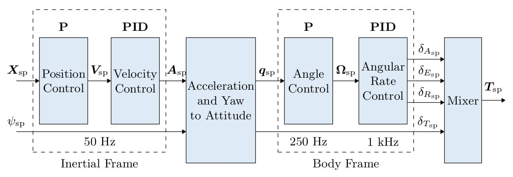
#### [discussion about controller PID, update rate](https://discuss.px4.io/t/multicopter-control-architecture-design-choices/31815)

這是一份針對自動化工程背景整理的重點筆記。我們從**頻寬設計（Bandwidth & Sampling）**與**控制架構（Topology）**兩個核心面向，解析為何無人機控制採用這種設計。

---

### 1. 頻率選擇：時間尺度分離原則 (Time Scale Separation)

在串級控制（Cascaded Control）中，內層迴路的頻寬必須遠高於外層迴路，以確保內層能視為「即時」響應外層的命令。

#### **為什麼角速率（Rate Loop）需要 1000Hz？**
*   **關鍵字：** `Fast Dynamics` (快速動力學), `Phase Lag` (相位延遲), `Loop Gain` (迴路增益)
*   **物理特性：** 角速率直接由電機力矩驅動。相較於位置變化，角速率的動態響應極快（電機時間常數 $\tau < 0.05s$），屬於**快速動態 (Fast Dynamics)** 系統。
*   **控制限制：** 若採樣率過低，數位控制帶來的時間延遲會造成顯著的**相位滯後 (Phase Lag)**。為了防止因延遲修正而導致的震盪，必須降低**迴路增益 (Loop Gain)**，但這會導致抗干擾能力下降。
*   **結論：** 為了減少滯後，允許使用較高的增益來精確鎖定姿態，必須維持高採樣率（如 1kHz）。

#### **為什麼位置/角度（Position/Angle Loop）只需 50-250Hz？**
*   **關鍵字：** `Slow Dynamics` (慢速動力學), `Estimator` (估測器), `CPU Efficiency` (運算效率)
*   **物理特性：** 這是外層迴路。要改變位置或角度，必須先改變角速率，再經由時間積分累積出實際的角度或位移變化。由於積分效應，這個物理變化過程相對緩慢（動態響應慢）。
*   **系統限制：** 位置與姿態數據來自**狀態估測器（如 EKF）**。以 1kHz 運行 EKF 極度消耗 CPU，且感測器（如 GPS、氣壓計）本身的更新率本來就低（GPS 通常僅 5-10Hz）。
*   **結論：** 跑太快沒有物理意義（看不到區別），只會浪費 CPU。50Hz 已足以涵蓋位置變化的動態。

#### **圖示：頻率與動態分層**

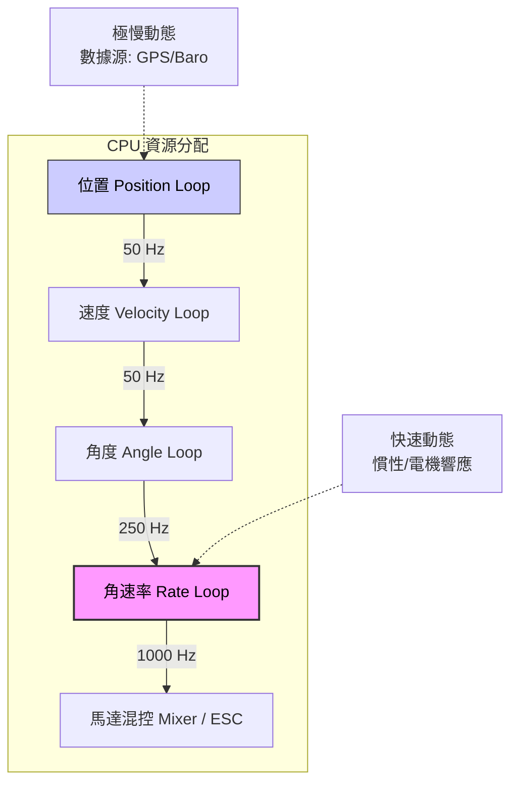

---

### 2. 控制器架構：為何採用 P-PID？

針對無人機姿態控制，標準架構通常是 **外層 P 控制器** 串接 **內層 PID 控制器**。

#### **內層（角速率）為何需要 I (積分器)？**
*   **關鍵字：** `Disturbance Rejection` (抗干擾), `Torque/Force` (力矩/力)
*   **物理意義：** 積分項（Integrator）的主要作用是**消除穩態誤差**並對抗**外部擾動**。
*   **場景：** 當風（Wind）吹過或機體重心不穩時，會產生額外的力矩（Torque）。若只有 PD 控制，系統會因為需要持續輸出對抗力矩而產生穩態誤差（飛機會歪一邊）。加上 I，控制器會自動累積誤差，輸出對抗力矩，確保角速率誤差歸零。

#### **外層（角度）為何只需要 P (比例)？**
*   **關鍵字：** `Type 1 System` (一型系統), `Natural Integrator` (天然積分器)
*   **自動化原理：**
    *   物理上，角速率（$\omega$）積分後就是角度（$\theta$）。即 $\theta = \int \omega \, dt$。
    *   這意味著，**被控對象（Plant）本身已經包含一個積分環節**（即 $\frac{1}{s}$）。這在控制理論中稱為 **Type 1 System（一型系統）**。
    *   對於一型系統，針對階躍輸入（Step Input，例如使用者想要維持 10 度傾角），純 P 控制器就能保證穩態誤差為零。
*   **邏輯推導：**
    1.  假設內層（PID）工作完美，角速率沒有誤差。
    2.  如果角度有誤差（$Error_{\theta} \neq 0$），P 控制器會輸出一個非零的角速率命令（$\omega_{cmd}$）。
    3.  內層執行這個 $\omega_{cmd}$，機體轉動，角度誤差隨之減小。
    4.  只要還有角度誤差，就會有角速率命令；直到角度誤差為零，角速率命令才為零，機體停止轉動。
    5.  **結論：** 不需要軟體積分器，物理積分器已經解決了穩態誤差。若在外層強加 I，反而引入額外相位滯後，導致震盪（Overshoot）。

#### **什麼時候外層才需要 I？**
*   只有在追蹤**斜坡訊號（Ramp Input）**（例如：要求飛機以恆定速度持續改變角度）時，Type 1 系統才會有穩態誤差，此時才需要額外的積分器。但在一般定點或姿態保持中，P 已足夠。

#### **圖示：P-PID 架構中的天然積分器**

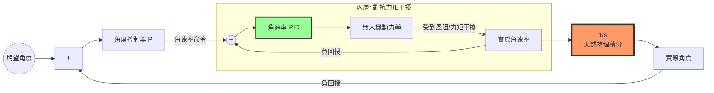

### 總結重點 (Takeaway)

1.  **頻率差異：** 是為了配合**物理慣性**（內快外慢）與**運算資源**（節省 CPU）的妥協。
2.  **內層 PID：** 用積分器（I）來硬扛風阻與力矩干擾。
3.  **外層 P：** 利用物理上的 $\text{Rate} \to \text{Angle}$ 轉換（ $\frac{1}{s}$）來消除誤差，不需要額外的 I(積分)

---

## Multicopter Angular Rate Controller
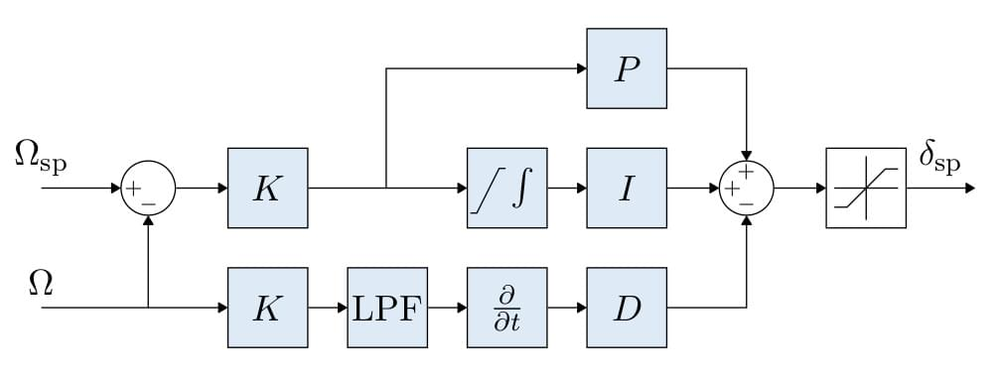

| 符號 / 節點 | 意義 | 功能說明 |
| :--- | :--- | :--- |
| **Ωsp** | Set-point (設定值) | 目標轉速或期望的狀態值。 |
| **Ω** | Process Variable (測量值) | 感測器回傳的實際轉速或當前狀態。 |
| **Summing Point (+/-)** | 加減運算節點 | 計算誤差 $e = \Omega_{sp} - \Omega$。 |
| **K** | Loop Gain (迴路增益) | 系統的總比例係數，用來縮放整體控制力道。 |
| **P** | Proportional (比例) | 負責主要的響應速度。 |
| **I** | Integral (積分) | 消除靜態誤差 (Steady-state error) 與抗擾動。 |
| **D** | Derivative (微分) | 提供阻尼 (Damping)，抑制震盪與過衝。 |
| **$\int$** | Integrator (積分器) | 對誤差進行時間累加。 |
| **LPF** | Low Pass Filter (低通濾波) | 濾除測量訊號中的高頻雜訊，防止微分項過度放大雜訊。 |
| **$\partial/\partial t$** | Differentiator (微分器) | 計算變化率，提供「預測」能力。 |
| **Saturation** | 飽和限制器 (最右方塊) | 防止輸出超出硬體極限 (如馬達最大轉速) 與積分飽和。 |
| **δsp** | Output (輸出值) | 控制器的最終輸出指令 (Torque Setpoint)。 |

#### 2. 整個迴路流程介紹 (Loop Flow Overview)
這是一個閉迴路控制系統 (Closed-loop Control)，主要流程如下：
*   **誤差計算**: 系統首先比較「想要達到的目標值 $\Omega_{sp}$」與「實際測得的值 $\Omega$」，得到誤差。
*   **分路處理**:
    *   **比例 (P) 與 積分 (I)**: 處理的是**誤差信號 (Error)**。確保系統往目標靠近並消除最後的微小偏差（穩態誤差）。
    *   **微分 (D)**: 處理的是**測量值 $\Omega$**。注意到微分項並非接在誤差後面，而是直接接在測量值之後。
        > **好處**: 當你突然改變 $\Omega_{sp}$ (User Input) 時，輸出不會因為微分項而產生瞬間衝擊 (Derivative Kick)。
*   **濾波處理**: 在微分路徑中加入了 **LPF**。這是非常實務的做法，因為微分會放大電子雜訊，濾波能讓控制更平穩，避免馬達異音。
*   **輸出加總與限制**: 三個路徑的結果最後相加，並通過一個飽和限制器 (Saturation) 輸出給執行器，防止數值超出物理極限。

#### 3. 原理公式 (Control Theory)
根據圖中的結構，輸出的時域公式可以表達為：

$$
\delta_{sp}(t) = \text{Sat} \left( P \cdot K(\Omega_{sp} - \Omega) + I \cdot \int K(\Omega_{sp} - \Omega) dt - D \cdot \frac{d}{dt} \text{LPF}(K \cdot \Omega) \right)
$$

若簡化不考慮 LPF 與 Saturation，標準的表達形式通常為：
*   **比例項**: $P(t) = K_p \cdot e(t)$
*   **積分項**: $I(t) = K_i \cdot \int e(t) dt$
*   **微分項（針對測量值）**: $D(t) = -K_d \cdot \frac{d\Omega}{dt}$

> **特殊之處**: 這張圖將總增益 **$K$** 提取到了前面，並對 $\Omega$ 進行了獨立的 LPF 微分處理，這是一種高性能工業控制器的典型結構。

#### **結構解析**
1.  **微分先行 (Derivative on Measurement)**:
    - 注意圖中的 D 項（下路）輸入源是 **$\Omega$ (測量值)** 而非誤差。
    - **目的**: 避免 **Derivative Kick**。當 Setpoint 突變（打桿）時，Error 會瞬間跳升，若對 Error 微分會產生極大突波。對測量值微分則能提供穩定的**阻尼 (Damping)**，抑制震盪。
    - **原理 (Prediction)**: 對角速率 ($\Omega$) 微分即為 **角加速度**。這讓控制器能「預知」運動趨勢。例如：當機體快速轉動時，D 項會偵測到加速度，並提前輸出反向力量（煞車）來防止過衝 (Overshoot)。
    - **LPF (低通濾波)**: 必備元件。因為 Gyro 數據充滿馬達震動噪音，微分會放大高頻雜訊，必須先濾乾淨才送入 D Gain。

2.  **$K$ (Loop Gain - 迴路增益)**:
    - 圖中的 $K$ 是一個常數，作為**整體放大倍率**。
    - **調參意義**: 如果 P、I、D 的比例配置正確，但整體反應過軟或過硬，可以單獨調整 $K$ 來放大或縮小整體的控制力道，而無需重新計算個別參數。 (在 PX4 參數中對應 `MC_ROLLRATE_K` 等，預設通常為 1.0)。

3.  **積分抗飽和 (Integrator Anti-Windup)**:
    - 圖中 I 項後的 Saturation 機制。防止因倒地或被卡住時，積分器無限累積誤差，導致解鎖瞬間暴衝。

4.  **前饋控制 (Feedforward - The Missing Piece)**:
    - 雖然圖中未畫出，但 PX4 的實作包含一個直接路徑：$\text{Output} = PID + (\text{Setpoint} \times \text{Gain}_{ff})$。
    - **作用**: PID 是「看到誤差才修正」（反應式）；FF 是「預判需求直接輸出」（預測式）。
    - 透過 FF 提供大部分所需的力矩，P 值只需處理模型誤差與擾動，這大幅提升了追蹤的響應速度 (Latency)。
---

Multicopter Attitude Controller
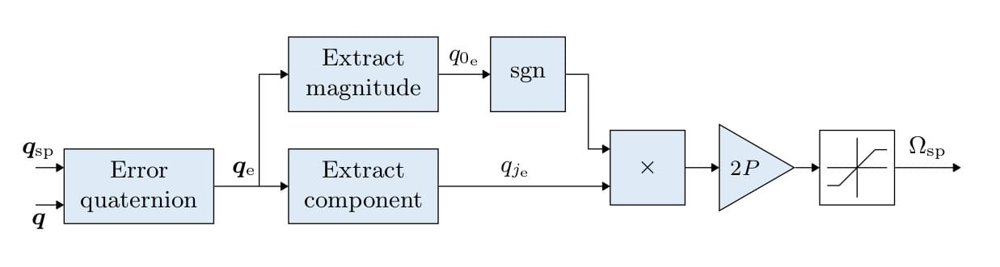

> **核心概念**: 比對「目標姿態」與「目前姿態」，並計算出應該以多快的「角速率」來修正。

#### 1. 核心符號介紹 (Key Symbols)
| 符號 | 定義 | 說明 |
| :--- | :--- | :--- |
| **$q_{sp}$** | Quaternion Setpoint | 目標姿態（四元數表示）。 |
| **$q$** | Current Quaternion | 目前飛行器的實際姿態。 |
| **$q_e$** | Error Quaternion | 姿態誤差。使用四元數是為了避免「吉姆保鎖 (Gimbal Lock)」問題。 |
| **$q_{0e}, q_{je}$** | Scalar & Vector Parts | 四元數的實部 (旋轉角度大小) 與 虛部 (旋轉軸方向)。 |
| **sgn** | Sign Function | 符號函數。確保旋轉路徑是**最短路徑**（防止飛機為了修正 10 度卻反向轉了 350 度）。 |
| **2P** | Proportional Gain | 姿態環的比例增益。注意這裡只有 P 項，因積分項由下層速率環處理。 |
| **$\Omega_{sp}$** | Rate Setpoint | 輸出的「目標角速率」。這會直接輸入到 Rate Controller。 |

#### 2. 運作流程介紹 (Workflow)
1.  **誤差計算**: 系統計算目標四元數與當前四元數的差異 $q_e$。
2.  **提取特徵**: 分別提取四元數的實部與虛部。
3.  **路徑優化**: 透過 $\text{sgn}(q_{0e})$ 處理，保證飛行器總是沿著最短的角度轉向目標。
4.  **比例放大**: 將誤差乘以 $2P$ 增益。這決定了飛機回正的「力道」。
5.  **飽和限制**: 最後輸出前經過 Saturation Block。

#### 3. 飽和限制機制 (Saturation Logic)
在姿態環（Attitude Loop）中，最後那個方塊限制的是 **$\Omega_{sp}$ (最大角速率)**。

*   **限制什麼？** 限制飛機旋轉的速度上限。
*   **靠哪個數值？** 在 PX4 中，對應的參數通常是：
    *   `MC_ROLLRATE_MAX`: 限制 Roll 軸最大旋轉速度（例如每秒 220 度）。
    *   `MC_PITCHRATE_MAX`: 限制 Pitch 軸最大旋轉速度。
    *   `MC_YAWRATE_MAX`: 限制 Yaw 軸最大旋轉速度。
*   **為什麼要限制？**
    *   如果沒有這個 Saturation，當姿態誤差 $q_e$ 很大時（例如手拋起飛或極端特技），$2P$ 會算出一組天文數字般的角速率。
    *   這會導致下層的 Rate Controller 輸出過猛，造成硬體受損或系統嚴重震盪。

---
### Acceleration to Thrust & Attitude Conversion

速度控制器產生的 **加速度設定值 (Acceleration Setpoints)** 需轉換為 **推力 (Thrust)** 與 **姿態 (Attitude)** 設定值才能控制飛行器。

#### 1. 優先權邏輯 (Priority Logic)
轉換後的加速度設定值會進行飽和限制 (Saturation)，且具有特定的優先順序：
*   **垂直推力 (Vertical Thrust) 優先**：先滿足高度控制的需求，剩下的推力才分給水平移動。這是為了防止掉高 (Loss of Altitude)。

#### 2. 推力飽和計算步驟 (Thrust Saturation Steps)
推力飽和是在計算出所需的總推力後進行的，具體算法如下：

1.  **計算垂直推力**: 計算所需的垂直推力 $\text{thrust}_z$。
2.  **垂直飽和**: 使用 `MPC_THR_MAX` 對 $\text{thrust}_z$ 進行限制。
    *   $\text{thrust}_z = \min(\text{thrust}_z, \text{MPC\_THR\_MAX})$
3.  **水平飽和**: 利用剩餘的推力餘裕來限制水平推力 $\text{thrust}_{xy}$。
    *   $\text{Limit} = \sqrt{\text{MPC\_THR\_MAX}^2 - \text{thrust}_z^2}$
    *   $\text{thrust}_{xy} = \min(\text{thrust}_{xy}, \text{Limit})$

> **程式碼參考**: 實作細節可參閱 `PositionControl.cpp` 與 `ControlMath.cpp`。

## Multicopter Velocity Controller
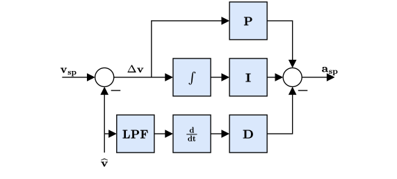

#### 1. 核心符號 (Key Symbols)
| 符號 | 定義 | 說明 |
| :--- | :--- | :--- |
| **$\mathbf{v}_{sp}$** | Velocity Setpoint | 目標速度向量 (通常來自搖桿輸入或自駕儀導航)。 |
| **$\hat{\mathbf{v}}$** | Estimated Velocity | 估測器 (EKF) 回傳的當前速度向量。 |
| **$\Delta \mathbf{v}$** | Velocity Error | 速度誤差 ($\mathbf{v}_{sp} - \hat{\mathbf{v}}$)。 |
| **$\mathbf{a}_{sp}$** | Acceleration Setpoint | 控制器輸出的目標加速度。這會被送往下一級轉換為推力與姿態。 |

#### 2. 控制迴路解析 (Control Loop Analysis)
這個控制器負責將「速度命令」轉換為「加速度命令」。架構上採用 **PID 控制**，但有特殊設計：

*   **P (比例) & I (積分)**:
    *   作用於 **誤差 ($\Delta \mathbf{v}$)**。
    *   **P 項**: 提供主要的回應力道，不僅針對當前誤差，也決定了追蹤的靈敏度。
    *   **I 項**: 關鍵在於消除**風力**或**機體不平衡**等外部持續干擾造成的穩態誤差。
*   **D (微分) on Measurement**:
    *   注意圖中的 D 項路徑源自 **$\hat{\mathbf{v}}$ (測量/估測值)**，並經過 **低通濾波 (LPF)**。
    *   **物理意義**: 對速度微分即為「加速度」。這項作為 **阻尼 (Damping)**，防止速度改變過快或震盪。當飛機突然加速時，D 項會產生反向訊號來抑制過衝。
*   **輸出公式**:
    *   $\mathbf{a}_{sp} = P \cdot \Delta \mathbf{v} + I \cdot \int \Delta \mathbf{v} dt - D \cdot \frac{d}{dt} \hat{\mathbf{v}}$

## Multicopter Position Controller

#### 1. 核心符號 (Key Symbols)
| 符號 | 定義 | 說明 |
| :--- | :--- | :--- |
| **$\mathbf{r}_{sp}$** | Position Setpoint | 目標位置向量 (例如 [x, y, z] 座標)。 |
| **$\hat{\mathbf{r}}$** | Estimated Position | 估測器 (EKF) 回傳的當前位置。 |
| **$\Delta \mathbf{r}$** | Position Error | 位置誤差 ($\mathbf{r}_{sp} - \hat{\mathbf{r}}$)。 |
| **$\mathbf{v}_{sp}$** | Velocity Setpoint | 控制器輸出的目標速度。這會被送往下一級的速度控制器。 |

#### 2. 控制迴路解析 (Control Loop Analysis)
這是最外層的迴路，結構非常簡單，通常只是一個 **P 控制器 (Proportional)**：

*   **P (比例)**:
    *   直接將 **位置誤差 ($\Delta \mathbf{r}$)** 乘以一個比例增益。
    *   **物理意義**: 「離目標越遠，就飛得越快」。這就是為什麼長距離飛行時無人機會先加速，接近目標時自動減速。
*   **飽和限制 (Saturation)**:
    *   圖中 P 後面的方塊。
    *   **目的**: 限制 **最大飛行速度 ($\mathbf{v}_{sp}$)**。
    *   **參數**: 例如 `MPC_XY_VEL_MAX` (水平最大速度) 和 `MPC_Z_VEL_MAX` (垂直最大速度)。如果不限制，當目標點在 1 公里外時，P 控制器可能會算出一個超音速的命令，這是不合理的。
*   **為何不需要 I (積分)？**:
    *   位置環的輸出是「速度」。只要有位置誤差，就會產生速度命令讓飛機移動。
    *   物理上，速度積分就是位置 ($\int v dt = r$)。這意味著**速度控制器本身就是位置控制器的天然積分器** (Type 1 System)。
    *   因此，外層通常只需要 P 就足以消除穩態誤差（除非是在追蹤移動目標）。

## Combined Position and Velocity Controller Diagram

#### 核心重點 (Key Takeaway)
這張圖是 **位置 (Position)** 與 **速度 (Velocity)** 控制器的合體版，但多了一個非常重要的細節：**前饋控制 (Feedforward, FF)**。

*   **前饋路徑 ($\mathbf{v}_{ff}$ 與 $\mathbf{a}_{ff}$)**：
    *   圖中顯示，來自軌跡規劃器 (Trajectory Planner) 的 **預期速度 ($\mathbf{v}_{ff}$)** 與 **預期加速度 ($\mathbf{a}_{ff}$)** 會**直接加入**到 Setpoint 中。
    *   **$\mathbf{v}_{ff}$**: 直接加在速度控制器的輸入端。如果不加這項，無人機必須先產生位置誤差 ($\Delta \mathbf{r}$) 才能有速度命令，這會導致追蹤延遲。加上 $\mathbf{v}_{ff}$ 後，無人機可以在誤差發生前就先動起來。
    *   **$\mathbf{a}_{ff}$**: 直接加在輸出端。這讓 PID 控制器只需要負責修正「殘餘誤差」，而不需要去產生全部的加速度。
*   **結論**:
    *   **Feedback (P/PID)**: 負責「修正誤差」 (Reactive)。
    *   **Feedforward (FF)**: 負責「執行命令」 (Proactive)。
    *   這兩者結合才是一個高效能的自動控制系統，這也是為什麼 PX4 能飛得這麼穩又這麼快的原因。