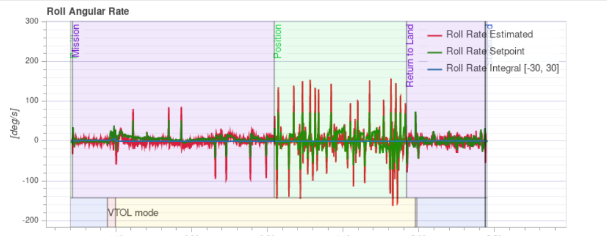
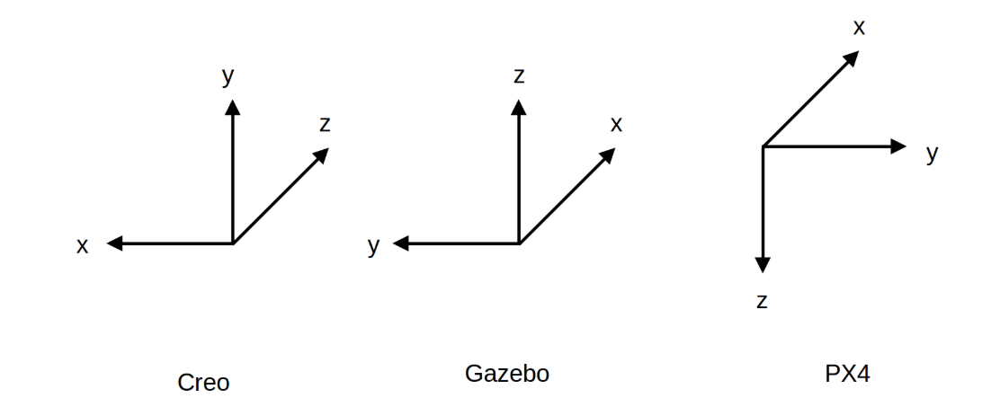
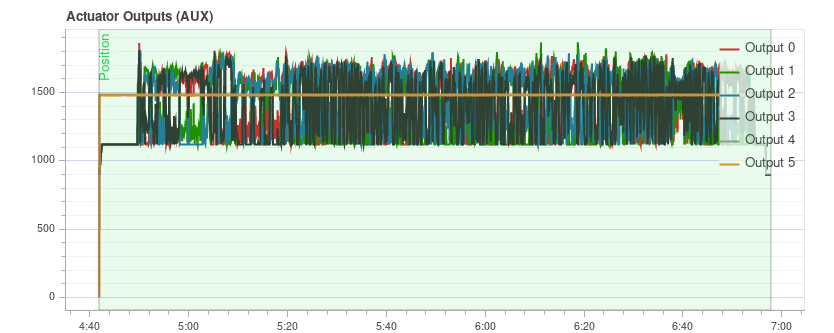
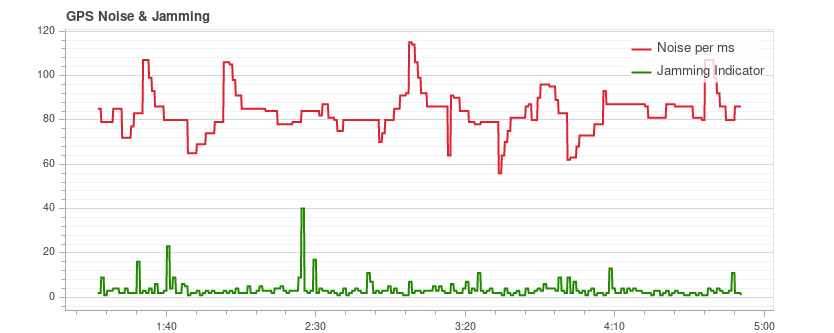

# PX4 Log Analysis Guide (日誌分析指南)

## 1. 常用工具 (Tools)
*   **Flight Review (線上)**: [review.px4.io](https://review.px4.io)
    *   最常用的第一線工具，上傳 `.ulg` 檔即可生成圖表。
    *   **優點**: 自動標記紅字 (Errors)、自動計算震動等級。
*   **PlotJuggler (本地)**
    *   深度分析必備。安裝 `plotjuggler-px4-plugins` 可直接讀取 ULog。
    *   **優點**: 可自定義公式 (如計算合力、功率)、放大縮小波形。

## PID Tracking Performance

- The Estimated line (red) should closely match with the Setpoint (green). If they do not, in most cases the PID gains of that controller need to be tuned.[ Multicopter PID Tuning Guide](https://docs.px4.io/main/en/config_mc/pid_tuning_guide_multicopter)

## [Vibration](https://docs.px4.io/main/en/log/flight_review#actuator-controls-fft)
Vibration is one of the most common problems for multirotor vehicles. High vibration levels can lead to:
    - less efficient flight and reduced flight time
    - the motors can heat up
    - increased material wearout
    - inability to tune the vehicle tightly, resulting in degraded flight performance.
    - sensor clipping
    - position estimation failures

以下段落和章節提供了有關使用哪些圖表來檢查振動水平以及如何分析這些圖表的資訊

## Actuator Controls FFT
**注意**: 此功能**無法**透過 QGC MAVLink Inspector 在即時飛行中查看。必須透過 **Flight Review** 分析飛行日誌 (`.ulg`)。

*   **用途**: 分析控制訊號中的噪聲頻率。
*   **分析方法**:
    *   圖表顯示了控制輸出的頻譜圖 (Frequency vs Amplitude)。
    *   **尖峰 (Peaks)**: 如果在特定頻率有明顯尖峰，代表有共振或濾波不足。
    *   **低頻區 (< 10Hz)**: 通常是飛機的動態響應 (正常)。
    *   **高頻區 (> 50Hz)**: 通常是馬達/槳葉震動或 PID D-term 噪聲。
*   **解決方案**:
    *   如果是高頻噪聲，可調整濾波器參數 (如 `IMU_GYRO_CUTOFF`, `IMU_DGYRO_CUTOFF`)。
    *   檢查硬體安裝是否鬆動。

## Raw Acceleration
*   **用途**: 檢查機架震動的最原始數據。
*   **查看位置**: Flight Review -> Raw Acceleration 圖表。
*   **標準**:
    *   **懸停時 (Hover)**: X/Y 軸震動應小於 $2~3 m/s^2$。
    *   **Z 軸**: 會包含重力 ($~9.8 m/s^2$)，震動幅度也應控制在一定範圍。
        *   **視覺法則**: 如果 Z 軸的波形 (約 -9.8) 震盪大到與 X/Y 軸波形 (約 0) **相切 (Tangent/Touching)**，代表震幅接近 $5 m/s^2$，震動**過高**。
    *   **震動來源**:
        *   **X/Y 軸**: 通常來自 **螺旋槳不平衡 (Propeller Unbalance)** 或馬達軸承問題。
        *   **Z 軸**: 除了槳葉因素，也可能來自機臂剛性不足 (Resonance) 或氣動干擾。
*   **異常處理**: 若震動過大，需檢查槳葉平衡 (Propeller Balancing) 或避震球 (Damping)。

## Actuator Outputs

- 感測器雜訊 或 振動過大

## GPS Noise & Jamming

*   **指標意義**:
    *   **Jamming Indicator**: 0-255，越低越好。**< 40** 為健康，**> 80** 代表受強干擾。內部
    *   **Noise**: 訊號底噪水平。環境或電源
*   **與 Speed Accuracy 差異**:
    *   **Jamming/Noise (訊號層)**: 檢查環境是否「乾淨」。反映硬體受電磁干擾程度 (EMI)。
    *   **Speed Accuracy (解算層)**: 檢查 GPS 輸出的「結果」準不準。
    *   **關係**: 若 Jamming 高，通常 Speed Accuracy 會變差；但 Speed Accuracy 差不一定是 Jamming (也可能是被遮擋、衛星數少)。

- 內部或是外部noise : 比對power , jamming indicator 

## Thrust and Magnetic Field

## 2. 分析三部曲 (Standard Operating Procedure)

### 第一步：健康檢查 (Health Check)
在看任何波形前，先看系統訊息。
*   **Messages**: 搜尋關鍵字 `Error`, `Failsafe`, `EKF check`, `Battery`。
*   **Battery**: 確認電壓是否有 **Sag (驟降)**，通常在高負載時發生。

### 第二步：震動分析 (Vibration)
硬體震動過大會導致軟體誤判。
*   **Clipping (削波/飽和)**:
    *   **定義**: 震動超過感測器量程 (如 IMU 16G)，數據被截斷。
    *   **標準**: **必須為 0**。只要出現 Clipping，代表姿態解算隨時會掛掉。
*   **Raw Acceleration (原始加速度)**:
    *   觀察 `sensor_combined` 的 `accelerometer_m_s2`。
    *   X/Y 軸震動應盡量小。

### 第三步：估測器健康 (Estimator / EKF Health)
檢查 EKF2 是否「迷航」。對應 Flight Review 中的 **Estimator Watchdog** 或 **Estimator Status**。

#### 關鍵參數 (Key Parameters)
在 PX4 Log 中通常查看 `estimator_status.innovation_test_ratio` 或類似指標。
*   **SV (Velocity Variance)**: 速度一致性檢查。
*   **SP (Position Variance)**: 位置一致性檢查 (GPS vs IMU)。
*   **SM (Magnetic Variance)**: 磁場一致性檢查。

#### 判讀標準 (Thresholds)
這些數值是歸一化 (Normalized) 的 Test Ratio：
*   🟢 **< 0.5**: **健康 (Good)**。EKF 很有信心。
*   🟡 **0.5 ~ 1.0**: **注意 (Warning)**。可能有干擾或震動偏大。
*   🔴 **> 1.0**: **危險 (Critical)**。EKF 判定感測器數據衝突 (Inconsistent)，會亮紅燈並可能觸發 Failsafe (如強制切換 Flight Mode)。

### 第四步：電磁干擾 (Magnetic Interference)
*   **公式**: $MagStrength = \sqrt{MagX^2 + MagY^2 + MagZ^2}$
*   **現象**: 總場強 (Total Strength) 應該是一個常數 (地磁強度)。
*   **診斷**: 如果 **油門 (Thrust)** 增加時，總場強跟著劇烈改變，代表是**機內電流干擾 (Internal mag field interference)**，需要校正或重擺 Compass 位置。

## 3. 除錯速查表 (Cheat Sheet)

| 現象 | 可能原因 | 檢查項目 |
| :--- | :--- | :--- |
| **無法解鎖 (Arming Denied)** | Pre-flight Check 失敗 | 檢查 `Messages` 尋找紅字錯誤 (如 EKF High Variance)。 |
| **定點亂飄 (Toilet Bowl)** | 磁羅盤受干擾 | 檢查 Mag Strength 是否隨油門變化。 |
| **姿態不穩 (Oscillation)** | PID 過大 或 震動過大 | 檢查 Rate Tracking (期望值 vs 實際值) 與 Vibration Clipping。 |
| **高度掉落 (Height Drop)** | 氣壓計受光照/氣流干擾 | 檢查 Barometer 數值是否有突波。 |
