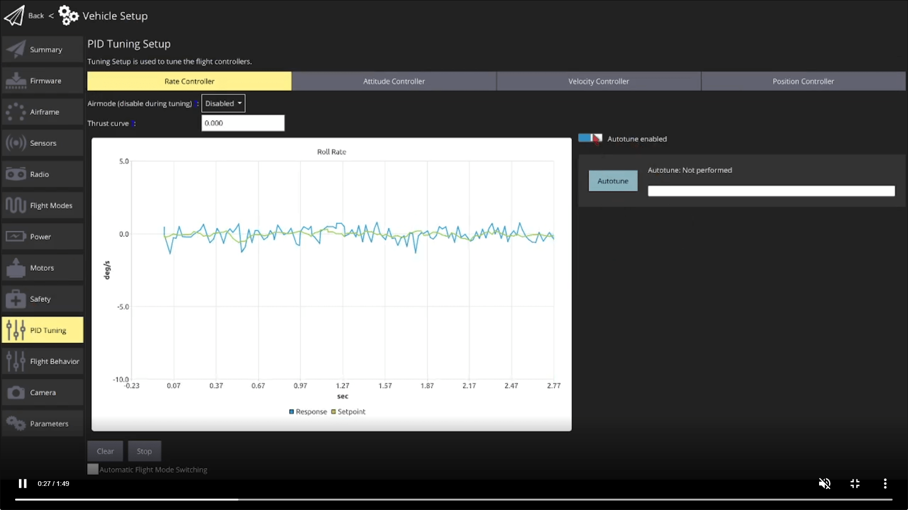

## info
- 自動調優功能適用於所有軸心運動性能和控制力都較為均衡的機架
- autotune有問題時才需要Manual tuning 
    -  MC PID Tuning (Manual/Basic) — Manual tuning basic how to.
    -  **MC PID Tuning Guide (Manual/Detailed)** — Manual tuning with detailed explanation (手動調校詳細指南)。從原理到實作完整的調參流程與物理意義分析。
- **MC Filter/Control Latency Tuning** (濾波與延遲調校) — Trade off control latency and noise filtering.
    - 在「控制響應速度 (Latency)」與「雜訊濾波 (Noise Filtering)」之間做取捨。濾波越強，雜訊越少但延遲越高 (飛起來手感笨重)。
- **MC Setpoint Tuning (Trajectory Generator)** (設定點/軌跡調校)
    - 調整無人機跟隨目標點的「手感」。例如 Stick 的靈敏度、最大加速度、以及煞車的快慢。
    - **MC Jerk-limited Type Trajectory** (加加速度限制軌跡)
      - 這是一種更平滑的軌跡類型。透過限制加速度的變化率 (Jerk)，讓飛行動作更柔順，減少機體震動與過衝。
- **Multicopter Racer Setup** (穿越機設定)
    - 針對高機動性、高響應需求的競速無人機進行的極限調校設定 (通常會犧牲部分穩定性換取反應速度)。

---
## autotune
- 自動調諧Rate ＆ Attitude controllers，實現穩定、響應迅速
- Tuning only needs to be done once, 除非改裝

Pre-tuning Test
- stabilize mode 確認飛行穩定
- position controlled modes 飛行穩定
- roll performance test：roll take about 3°,The vehicle should stabilise itself within 2 oscillations. (從3°到20°漸進測試)
- Repeat the same maneuvers but on the pitch axis.
- If the drone can stabilize itself within 2 oscillations it is ready for the auto-tuning procedure.

warning
- If the drone cannot stabilize itself sufficiently, [troubleshooting](https://docs.px4.io/main/en/config/autotune_mc#troubleshooting)

## Auto-tuning Procedure
- 該程序大約需要 40 秒（ 19 至 68 秒之間 ）。為獲得最佳結果，我們建議在風平浪靜的天氣條件下進行測試。
- 推薦使用 `altitude` mode, 其他也行, 期間不能使用遙控器搖桿（移動搖桿會停止自動調諧操作）

The test steps are:
1. Perform the pre-tuning test.
2. Takeoff using RC control in Altitude mode. Hover the vehicle at a safe distance and at a few meters above ground (between 4 and 20m).
3. Enable autotune.
4. 飛機會**自動依序**完成 Roll $\to$ Pitch $\to$ Yaw 的所有測試 (Rate + Attitude)。過程約 40 秒，等待直到 QGC 顯示 "Success"。

5. 降落, armed, 在緩緩起飛測試效果 

Additional notes:
- position穩定也可透過位置模式autotuning
- 可以透過參數配置在飛行中還是著陸後進行調優, 參考[troubleshooting](https://docs.px4.io/main/en/config/autotune_mc#troubleshooting)
- fixwing 在空中套用新參數

---
## MC Filter/Control Latency Tuning
- 在「控制響應速度 (Latency)」與「雜訊濾波 (Noise Filtering)」之間做取捨。濾波越強，雜訊越少但延遲越高 (飛起來手感笨重)。

1