# Native ROS 2 ArduPilot Development (Phase 1)

**最後更新時間**: 2026-01-17
**狀態**: ✅ Phase 1 (Native SITL) 完成

本文件記錄了在 **Ubuntu 22.04 + ROS 2 Humble + Gazebo Fortress** 環境下，成功建立 Native ArduPilot 開發環境的完整過程與配置。

---

## 🏗️ 系統架構 (System Architecture)
我們採用「原生存活 (Native)」策略，所有元件直接運行於 Host (Ubuntu 22.04)，不使用 Docker，以獲得最佳效能與硬體支援 (如 GPU)。

| 元件 | 版本 | 安裝方式 | 備註 |
| :--- | :--- | :--- | :--- |
| **OS** | Ubuntu 22.04 LTS | - | 顯示伺服器為 Wayland (需特殊 param) |
| **ROS 2** | **Humble** | Binary (`apt`) | 穩定版，不需編譯 |
| **Gazebo** | **Fortress** | Binary (`apt`) | ROS 2 Humble 的官方推薦搭配 |
| **ArduPilot** | **Copter-4.6.3** | Source | 使用 `waf` 編譯 SITL，鎖定穩定 tag |
| **Bridge** | `ardupilot_gazebo` | Source | 分支 `fortress`，提供 JSON 介面 |
| **GCS** | **QGroundControl** | AppImage | 獨立執行檔，支援 MAVLink |

---

## 🛠️ 關鍵解決方案 (Troubleshooting Log)
為了讓這一套系統在 Ubuntu 22.04 上跑起來，我們解決了以下關鍵問題：

### 1. Gazebo 灰畫面/空白 (Grey Screen)
**原因**: Ubuntu 22.04 預設使用 Wayland，且 Ignition Ogre2 渲染引擎對其支援不佳。
**解法**:
*   `export QT_QPA_PLATFORM=xcb` (強制 Qt 使用 X11 後端)
*   `export IGN_RENDER_ENGINE=ogre` (強制使用 Ogre1 引擎，較穩定)
*   `export IGN_IP=127.0.0.1` (強制 GUI 綁定本機 IP，解決 Entity Tree 空白)
*   `export IGN_PARTITION=sim` (隔離通訊分區)

### 2. SITL 連不上 Gazebo (Magic Number Error)
**原因**: `sim_vehicle.py` 預設的 `-f gazebo-iris` 可能使用舊版 Binary 協議，但新編譯的 Plugin 使用 JSON 協議。
**解法**:
*   啟動時加入 `--model JSON` 參數。

### 3. QGC "Second Instance"
**原因**: AppImage 掛載點未清空或 Lock file 殘留。
**解法**:
*   `killall -9 QGroundControl.AppImage`
*   `rm -f /tmp/QGC.lock`

---

## 🚀 快速啟動 (Quick Start)

### 1. 啟動模擬環境
我們已編寫了一鍵啟動腳本，會自動設定所有環境變數並開啟 Tmux：

```bash
cd /media/user/Linux_Extra/workspaces
./native_sim_launch.sh
```

這將會開啟 3 個視窗 (Tmux Panes)：
1.  **SITL**: ArduPilot 核心。
2.  **Gazebo**: 3D 物理模擬視窗 (會自動跳出)。
3.  **Bridge**: ROS 2 Bridge (負責轉發 `/imu` 等話題)。

### 2. 啟動地面站 (GCS)
在新的終端機執行：
```bash
/media/user/Linux_Extra/workspaces/qgc/QGroundControl.AppImage
```
它會自動連線到 SITL，您應該能看到 "Ready To Fly"。

### 3. 使用 ROS 2 監看數據
```bash
# 查看話題列表
ros2 topic list

# 監看 IMU 數據
ros2 topic echo /imu
```

---

## 🗺️ 新手學習地圖 (Learning Path)

### Level 1: 熟悉工具 (完成)
*   [x] 成功啟動模擬器。
*   [x] 使用 QGC 執行起飛 (Takeoff) 與降落 (Land)。
*   [x] 在 Terminal 看到 ROS 2 數據在跳動。

### Level 2: 基礎控制 (Next Step)
*   [ ] 撰寫 Python Script，使用 `mavros` 或 `rclpy` 發送起飛指令。
*   [ ] 嘗試在 Gazebo 中加入障礙物，觀察無人機行為。

### Level 3: 視覺整合
*   [ ] 在 Gazebo 模型加入相機 (Camera)。
*   [ ] 設定 `ros_gz_bridge` 轉發影像話題。
*   [ ] 使用 OpenCV 或是 YOLO 進行物體識別。

---

## 📂 檔案清單
*   `install_native_ros2_sim.sh`: 環境安裝腳本 (含 ArduPilot, ROS 2, Plugin)。
*   `native_sim_launch.sh`: **日常啟動腳本 (包含所有修復參數)**。
*   `ros_gz_bridge.yaml`: Bridge 設定檔 (定義要轉發 Topic)。
*   `NativeROS2Dev.md`: 本說明文件。

---

## 🎓 實做練習 (Phase 2 Exercises)

現在您已經有一個穩定的開發環境，請嘗試完成以下練習以熟悉操作流程：

### 練習 1: 基礎飛行操作 (QGroundControl)
無需撰寫程式碼，先熟悉 GCS (地面站) 操作。
1.  **切換模式**: 在 QGC 頂部工具列點擊 "Flight Mode"，嘗試切換 `Loiter` (停懸), `PosHold` (定點), `Land` (降落)。
2.  **自動任務 (Auto Mission)**:
    *   切換到 **Plan** 視圖。
    *   點擊地圖設定 3-4 個 Waypoint (航點)。
    *   設定高度 (例如 5m)。
    *   點擊 **Upload** 上傳任務。
    *   回到 **Fly** 視圖，解鎖 (Arm) -> 切換至 `Auto` 模式，觀察飛機依路徑飛行。

### 練習 2: ROS 2 數據監控 (Data Observation)
確認模擬器物理數據能否傳遞至 ROS 2 層。
1.  啟動模擬 (`./native_sim_launch.sh`)。
2.  開啟新終端機，監聽 IMU 數據：
    ```bash
    source /opt/ros/humble/setup.bash
    ros2 topic echo /imu
    ```
    *觀察*: 確認 `linear_acceleration` 和 `angular_velocity` 數值是否隨飛機姿態變動。
3.  查看時鐘 (Clock) 同步：
    ```bash
    ros2 topic echo /clock
    ```
    *觀察*: 確認 `sim_time` 是否正常增加。

### 練習 3: 進階控制準備 (Offboard Control)
目標是讓外部程式 (ROS 2 Node) 控制飛機，而非僅用遙控器或 QGC。
*   此階段需要修改 `ros_gz_bridge.yaml`，加入指令相關的 Topic (如 `/cmd_vel` 或 `/quaternion`)。
*   這是進入自動駕駛開發的關鍵一步。


### 系統架構圖 (System Architecture)
這張圖解釋了為什麼 `rqt_graph` 只看得到一部分：

```mermaid
graph TD
    subgraph "Gazebo (模擬世界)"
        A[無人機物理模型] 
        note1[產生真實物理數據<br>例如：撞地板瞬間]
    end

    subgraph "SITL"
        FlightCode[ArduPilot 韌體]
    end

    subgraph "Bridge (翻譯官)"
        B[ros_gz_bridge]
    end

    subgraph "ROS 2 系統 (您的程式)"
        C[imu_monitor.py]
        note2[邏輯判斷中心]
    end

    A -- "Ignition Topics (/imu)" --> B
    B -- "ROS Topics (/imu)" --> C
    FlightCode -- MAVLink --> A
    
    style A fill:#f9f,stroke:#333
    style C fill:#bbf,stroke:#333
    style B fill:#bfb,stroke:#333
```


*   **藍色區塊** (`imu_monitor`) 與 **綠色區塊** (`ros_gz_bridge`) 是 `rqt_graph` 看得到的。
*   **ArduPilot** 與 **Gazebo內部** 對 ROS 工具來說是隱形的。

---
**Enjoy your flight! ✈️**

### 實作里程碑 (Milestones)

#### ✅ Phase 2: 自動飛行控制 (Offboard Control)
我們成功實作了第一個 Python 控制腳本 `ros2_scripts/mission_control.py`，實現了自動起降任務。

**核心架構 (Key Concepts)**:
1.  **通訊鏈路**: Python Script -> ROS 2 Service -> MAVROS -> UDP -> ArduPilot SITL。
2.  **模式切換**: 必須先將飛控切換至 `GUIDED` 模式，才能接受外部電腦指令。
3.  **狀態流程**: 連線 -> 解鎖 (Arm) -> 起飛 (Takeoff) -> 懸停 (Hover) -> 降落 (Land)。

**執行指令**:
```bash
# 1. 啟動模擬器
./native_sim_launch.sh
# 2. (在 SITL 視窗輸入 'output add 127.0.0.1:14551')

# 3. 啟動 MAVROS (UDP Server Mode)
ros2 run mavros mavros_node --ros-args -p fcu_url:=udp://:14551@

# 4. 執行任務腳本
python3 ros2_scripts/mission_control.py
```

---
**Enjoy your flight! ✈️**
