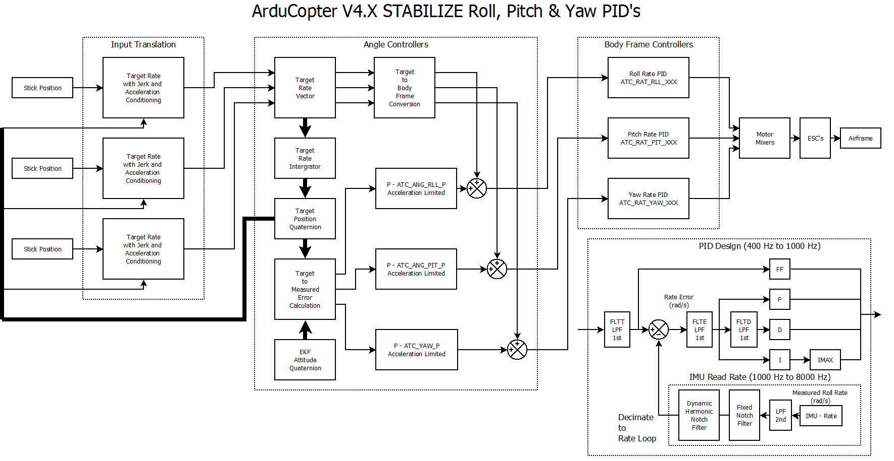
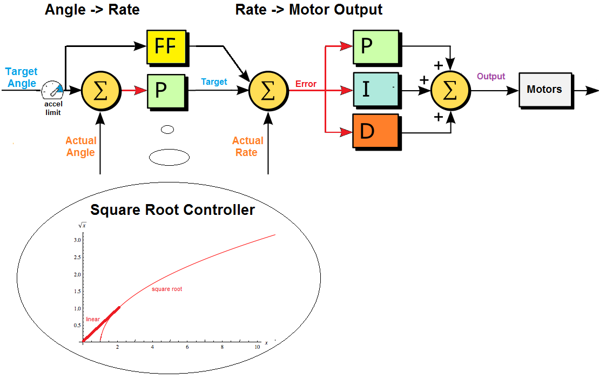
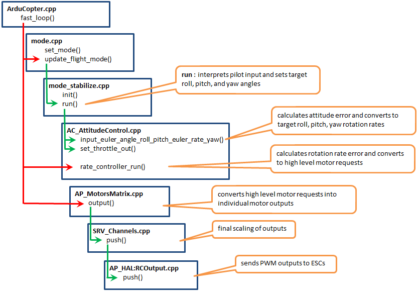

## Phase 1: 物理模型與致動 (The Plant)
> **目標**：理解被控體（多旋翼機）的物理特性。
- **剛體動力學 (Rigid Body Dynamics)**
  - 理解推力 (Thrust)、反扭矩 (Torque) 與轉動慣量 (Inertia Matrix) 的關係。
  - **Motor Mixer**: 理解 `Roll/Pitch/Yaw` 力矩指令如何被「解算」分配給 4 顆（或更多）馬達。
    > **🛠️ 實際案例學習：Quad-X 混控算式**
    > 假設我們要讓飛機 **「向右滾轉 (Roll Right)」** 且 **「向左偏航 (Yaw Left)」**：
    > *   **物理直覺**：
    >     *   Roll Right -> 左邊馬達要加速 (升力大)，右邊馬達要減速。
    >     *   Yaw Left -> 順時針 (CW) 馬達要加速 (利用反扭矩讓機身左轉)，逆時針 (CCW) 馬達要減速。
    > *   **ArduPilot 定義 (Quad X)**：
    >     *   Motor 1 (右前, CCW), Motor 2 (左後, CCW), Motor 3 (左前, CW), Motor 4 (右后, CW)
    > *   **數學解算 (Mixer Logic - Text Version)**：
    >     ```text
    >     M1 (右前) = Throttle - Roll - Pitch + Yaw
    >     M2 (左後) = Throttle + Roll + Pitch + Yaw
    >     M3 (左前) = Throttle + Roll - Pitch - Yaw
    >     M4 (右後) = Throttle - Roll + Pitch - Yaw
    >     ```
    >     *(註：這表示：要向右滾轉 -> Roll 為正 -> M2/M3 增加推力，M1/M4 減少推力)*
    >     *(註：正負號取決於馬達位置與旋向，控制組必須能看這張表推導出物理行為)*

# Phase 2: 串級控制架構 (Cascade Control Architecture)







> **為什麼要分成這麼多層？**
> 因為物理反應速度不同。馬達反應最快 (400Hz)，機身轉動次之 (100Hz)，飛到下一個航點最慢 (10Hz)。

### 1. 層級詳解 (由內而外)

#### **內核：角速度環 (Rate Loop)**
*   **任務**: 讓飛機「不准動」或「以特定速度轉動」。
*   **輸入**: `Target Rate` (例如: 每秒向右滾 30度)
*   **輸出**: `Motor PWM`
*   **場景**: 當一陣強風吹來，飛機被吹歪的瞬間 (0.01秒)，只有這層能反應過來，立刻加馬達推力把飛機「頂」回去。

#### **中層：姿態環 (Attitude Loop)**
*   **任務**: 讓飛機「保持水平」或「傾斜特定角度」。
*   **輸入**: `Target Angle` (例如: 向右傾斜 10度)
*   **輸出**: `Target Rate` (交給內核去執行)
*   **爭議點**: *ROS 2 會對這層下命令嗎？*
    *   **一般情況 (Offboard（guide mode 由companion computer 控制）)**: 不會。通常發送 `SET_POSITION_TARGET_LOCAL_NED` (速度/位置)。
    *   **特殊情況 (Advanced)**: **會！**
        *   **視覺伺服 (Visual Servoing)**: 當鏡頭看到球在畫面右邊，為了極快鎖定，演算法直接算出「機身傾角」給飛控，跳過位置環 (IBVS)。
            *   **Step 1. OpenCV 節點**：算出目標在影像中的像素座標 $(u, v)$。
            *   **Step 2. PID 控制 (Python)**：
                *   水平誤差 $(u_{target} - u)$ -> 輸出 **Target Roll**。
                *   垂直誤差 $(v_{target} - v)$ -> 輸出 **Target Pitch** (或 Throttle)。
            *   **Step 3. MAVROS**：透過 `SET_ATTITUDE_TARGET` 讓飛機瞬間側傾追球。

#### **外層：位置/導航環 (Position Loop)**
*   **任務**: 讓飛機「飛到坐標 (100, 20)」或「以 5m/s 前進」。
*   **輸入**: `Target XYZ` 或 `Target Velocity`
*   **輸出**: `Target Angle` (思考：要向前飛，機頭就必須向下壓 -> Pitch Down)

---

### 🌟 實戰案例：無人機追車 (Visual Tracking)

假設你的 ROS 2 AI 看到前方有一台車，決定「以 5m/s 向前追」。

1.  **ROS 2 (大腦)**: 發送 `/mavros/setpoint_velocity/cmd_vel` (Vx = 5 m/s)。
2.  **Position Loop (導航員)**: 收到指令。為了達到 5m/s，它計算出需要 **「低頭 15 度 (Pitch -15°)」**。
    *   *輸出: Target Pitch = -15°*
3.  **Attitude Loop (駕駛員)**: 收到指令。目前飛機是平的 (0°)，誤差是 -15°。為了要低頭，它命令 **「以 20度/秒 的速度向下轉」**。
    *   *輸出: Target Pitch Rate = -20 deg/s*
4.  **Rate Loop (機械師)**: 收到指令。為了達成這個轉速，它命令 **「後方馬達加速，前方馬達減速」**。
    *   *輸出: Motor PWM 改變*
5.  **The Plant (物理)**: 馬達轉速改變 -> 產生力矩 -> 機身轉動 -> 飛機向前衝。

這就是串級控制的精隨：**一層包一層，職責分離。**
- **感測器特性 (Sensors)**1. IMU (Inertial Measurement Unit) - 脾氣暴躁的快槍手
  - **1. IMU (加速度計 Accel + 陀螺儀 Gyro) - 脾氣暴躁的快槍手**
    *   **特性 A：頻寬極高 (High Bandwidth)**
        *   反應速度可達 1kHz ~ 32kHz。當風吹歪飛機時，GPS 還沒反應，Gyro 早就感覺到了。
        *   **控制意義**：Rate Loop (角速度環) 只能依賴 Gyro。
    *   **特性 B：對震動極度敏感 (Vibration Sensitivity)** ⚠️
        *   機架太軟或槳葉不平衡會產生高頻雜訊 (Aliasing)。就像在地震中端水，手會亂抖。
        *   **解決方案**：
            *   硬體：動平衡、減震球。
            *   軟體：Notch Filter (陷波濾波器)。
    *   **特性 C：積分飄移 (Drift)**
        *   靠「感覺速度」推算位置，時間久了誤差會累積，導致位置偏差。

  - **2. GPS & Barometer - 遲鈍但誠實的校正者**
    *   **特性 A：更新率低 (Low Update Rate)**
        *   GPS (5-10Hz), Barometer (50Hz)。
        *   **意義**：不能用於姿態控制，否則會震盪。
    *   **特性 B：延遲 (Latency)**
        *   GPS 解算延遲約 100-200ms。告訴你的位置是「0.2秒前的你」。
    *   **特性 C：絕對位置 (Absolute Accuracy)**
        *   雖然慢，但不會隨時間飄移。核心價值是用來 **把飄走的 IMU 拉回來**。

    > **🌟 實戰案例：ArduPilot EKF 感測器融合**
    > 想像你在黑暗中走鋼索：
    > *   **瞬時 (400Hz)**：靠 **內耳前庭 (IMU)** 保持平衡，修正身體傾斜 (Rate Loop)。
    > *   **定時 (5Hz)**：偷瞄一眼遠方的燈塔 **(GPS)**，確認大方向沒走歪 (Position Loop)。
    >
    > *結論*：IMU 爛掉 (震動大) -> 失去平衡墜毀；GPS 爛掉 (干擾) -> 走歪但不會翻機。
