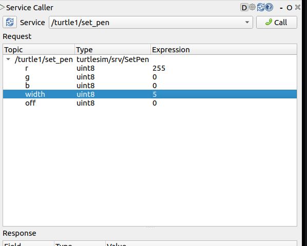

# 使用 Turtlesim, ros2 CLI 與 rqt

本章節介紹 ROS 2 最基礎的模擬工具、命令列介面與圖形化工具，這些是學習真實機器人之前的核心基礎。

---

## 🐢 Turtlesim 簡介
Turtlesim 是一個輕量級的模擬器，展示了 ROS 2 的核心功能。透過它，您可以學習如何控制機器人、查看主題與處理感測器資訊，了解未來操作真實機器人時可能遇到的挑戰。

## 🛠️ ros2 CLI 工具
這是使用者管理、檢查和與 ROS 2 系統互動的主要方式。它支援多種指令，功能包括：
*   啟動節點 (`ros2 run`)
*   檢查與監聽主題 (`ros2 topic`)
*   設定與獲取參數 (`ros2 param`)
*   管理節點生命週期與服務。

## 🖼️ rqt (圖形使用者介面)
`rqt` 是 ROS 2 的圖形工具框架。雖然所有操作都可以在終端機中完成，但 `rqt` 提供了一個更直觀、友善的 GUI，方便查看節點關係圖 (Node Graph) 或進行即時調試。

---

## 📥 安裝 Turtlesim
在執行前，請確保已安裝相關套件（以 Humble 版本為例）：
```bash
sudo apt update
sudo apt install ros-humble-turtlesim
```

## 🚀 啟動 Turtlesim 模擬器
開啟一個終端機並執行：
```bash
ros2 run turtlesim turtlesim_node
```

### 🎮 使用鍵盤控制海龜運動
開啟「另一個」新視窗，執行：
```bash
ros2 run turtlesim turtle_teleop_key
```

### 🔍 系統檢查清單
使用 `list` 子指令來查看目前的節點、主題、服務與動作：

| 範疇 | 指令 | 作用 |
| :--- | :--- | :--- |
| **Node** | `ros2 node list` | 列出目前運行的所有節點 |
| **Topic** | `ros2 topic list` | 查看目前的通訊主題 |
| **Service** | `ros2 service list` | 查看可用的服務 |
| **Action** | `ros2 action list` | 查看目前的動作 (如海龜旋轉) |

---

## 🖼️ 使用 rqt 工具
`rqt` 提供視窗化介面，其中最常用的是 **Node Graph**。

1. **啟動 rqt**: `rqt`
2. **開啟 Node Graph**: `Plugins` -> `Introspection` -> `Node Graph`

---

## 🐣 產生多隻海龜 (Service Call)
您可以使用 `/spawn` 服務來在模擬器中增加更多海龜：
```bash
# 範例：在 (5, 5) 位置產生名為 turtle2 的海龜
ros2 service call /spawn turtlesim/srv/Spawn "{x: 5.0, y: 5.0, theta: 0.0, name: 'turtle2'}"
```

### 🖌️ 設定畫筆屬性 (Set Pen)

使用 `/turtle1/set_pen` 可以調整海龜軌跡的顏色與粗細。

---

## 🔄 重點功能：重新映射 (Remapping)
當有多隻海龜時，為了分開控制不同海龜，我們需要將 `cmd_vel` 主題名稱進行**重新映射**。

### 🎮 獨立控制第二隻海龜 (turtle2)
```bash
# 將預設的 turtle1/cmd_vel 映射到 turtle2/cmd_vel
ros2 run turtlesim turtle_teleop_key --ros-args --remap turtle1/cmd_vel:=turtle2/cmd_vel
```

---

