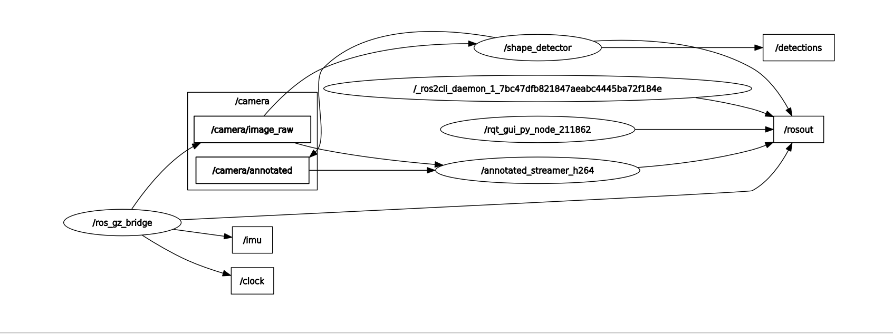
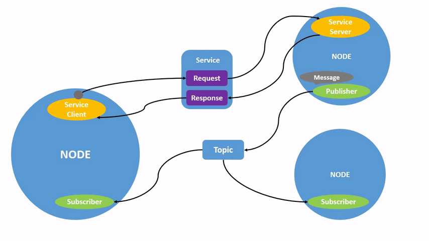
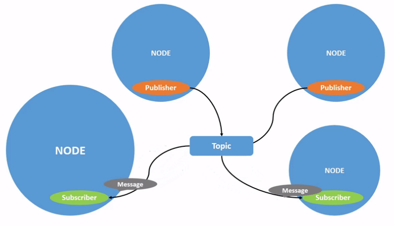

# ROS 2 架構觀念地圖 (Concept Map)


*圖示：使用 rqt_graph 視覺化 Gazebo 相機與 Shape Detector 之間的數據流向*


這是一份啟發式筆記，用於快速回憶 ROS 2 核心架構。

---

## 🏗️ 實體層 (Entities) - "Who?"
> 系統中的「員工」，負責執行具體工作。

### 關鍵字 (Key Words)
*   **Node (節點)**: 最小執行單位 (Process)。 
    *   *特徵*: 專注做一件事 (e.g., 相機驅動、形狀偵測)。
    *   *啟發*: 就像辦公室裡的單一員工。
*   **Discovery**: 自動發現機制。
    *   *特徵*: 節點啟動後會自動互相看見，不需手動連線。


---

## 📡 溝通層 (Communication) - "How?"
> 員工之間傳遞資訊的方式。

### Pattern A: 廣播模式 (Streaming)
*   **Topic (話題)**: 公佈欄 / 廣播頻道。
    *   **Publisher (發布者)**: 拿大聲公講話的人。 (e.g., Gazebo 相機)
    *   **Subscriber (訂閱者)**: 在台下聽講的人。 (e.g., Shape Detector)
    *   **Message (訊息)**: 傳遞的內容 (Data Type)。
        *   *Strongly Typed (強型別)*: 發送格式必須 = 接收格式 (e.g., `sensor_msgs/msg/Image`)。
    *   **QoS (服務品質)**:
        *   `RELIABLE` (掛號信): 重要指令，不可掉包。
        *   `BEST_EFFORT` (平信): 影像串流，掉了就算了。

### Pattern B: 請求模式 (Call/Response) - *Next Step*
*   **Service (服務)**: 打電話 / 點餐。
    *   *特徵*: 雙向確認 (Request -> Response)。常用於改變狀態 (e.g., 起飛、解鎖)。

---

## 🛠️ 工具層 (Tools) - "Observe"
> 上帝視角，用來監控和除錯。

### 視覺化 (Visualization)
*   **`rqt_graph`**: 關係圖。
    *   *功能*: 畫出 Node 和 Topic 的連線圖。
    *   *盲點*: 預設會隱藏 Dead sinks (沒人接的線) 和 System topics。

### 聽診器 (Inspection)
*   **`ros2 topic list`**: 列出所有頻道。
*   **`ros2 topic echo /<name>`**: 偷聽內容 (即時印出數據)。
*   **`ros2 topic hz /<name>`**: 量測頻率 (心跳聲)。
*   **`ros2 topic info /<name>`**: 查身家 (誰發的？誰收的？Type 是什麼？)。

### Log 系統 (Logging)
*   **`/rosout`**: 系統總廣播。
    *   *功能*: 收集所有節點的 print/error log。
*   **`rqt_console`**: 專門看 Log 的過濾器。
- 想要一個現代化、好看、功能強大的綜合控制台來取代 rqt：選 Foxglove Studio。
- 分析波形、PID 調試、看數據曲線：選 PlotJuggler。
- 3D 點雲、地圖：繼續用 RViz2。
---

## 🚀 進階概念 (Pro Concepts) - "Architect"
> 架構師思維，如何設計大型系統。

1.  **Remapping (接線生)**
    *   *核心*: **Decoupling (解耦)**。程式碼寫 `sub("input")`，執行時才決定 `input` 是 `/camera/front` 還是 `/camera/back`。
2.  **Namespace (資料夾)**
    *   *核心*: **Organization (組織)**。用 `/drone1/...` 把相關話題包起來，避免撞名。
3.  **Interface (.msg)**
    *   *核心*: **Contract (合約)**。定義大家溝通的語言格式。


---

## 實戰流程 (Workflow)
1.  **List**: 先看有哪些話題 (`topic list`)
2.  **Graph**: 看誰連給誰 (`rqt_graph`) -> *發現斷線?*
3.  **Info**: 查格式對不對 (`topic info`)
4.  **Interface**: 查格式裡面長怎樣 (`interface show`)
5.  **Echo**: 真的有數據在跑嗎？ (`topic echo`)


---

## 🧪 實作演練：節點 (Node) 與 重新映射 (Remapping)

### 1. 列出目前節點
使用 `ros2 node list` 查看目前系統中運行的節點：
```bash
ros2 node list
```

**輸出範例：**
```text
/rqt_gui_py_node_838635
/teleop_turtle
/turtlesim
```

### 2. 啟動節點
例如開啟控制海龜的按鍵節點：
```bash
ros2 run turtlesim turtle_teleop_key
```

### 3. 🤔 什麼是重新映射 (Remapping)？
重新映射可讓您在**不修改程式碼**的情況下，將節點的預設屬性（如：節點名稱、主題名稱、服務名稱）重新命名。這在有多個相同設備（如兩台相機）時非常有用。

#### 🔹 實例：修改節點名稱 (`__node`)
將節點名稱從預設的 `turtlesim` 改為 `my_turtle`：
```bash
ros2 run turtlesim turtlesim_node --ros-args --remap __node:=my_turtle
```

### 4. 查詢節點詳細資訊
使用 `node info` 檢查節點的訂閱 (Subscriptions) 與發布 (Publications) 狀態：
```bash
ros2 node info /my_turtle
```

> **💡 實戰觀察 (Observation)**
> 1. **名稱取代**：當執行了 `--remap __node:=my_turtle` 後，原本的 `/turtlesim` 就會**失效**。查詢 `ros2 node info /turtlesim` 會顯示找不到節點。
> 2. **唯一性**：重新映射是「更名」而非「別名」，系統中只會存在更名後的節點名稱。
> 3. **通訊檢查**：如果 `node info` 找不到節點但 `node list` 有看到，請先確認 `ROS_DOMAIN_ID` 是否在所有窗口中完全一致。

---

## 📡 深入理解話題 (Topic Operations)



### 🏁 實戰任務 (Task)
請依照順序啟動以下工具，觀察節點間的數據流向：
1. **啟動模擬器**: `ros2 run turtlesim turtlesim_node`
2. **啟動操縱桿**: `ros2 run turtlesim turtle_teleop_key`
3. **啟動視覺化關係圖**: `ros2 run rqt_graph rqt_graph` (或在 `rqt` 插件選單開啟)

---

### 🔧 常用話題指令 (Topic CLI)

#### 1. 列出與過濾
* **顯示話題及其類型 (Type)**:
  ```bash
  ros2 topic list -t
  ```

#### 2. 監控數據流
* **即時查看傳輸數據**:
  ```bash
  # 語法: ros2 topic echo /<topic_name>
  ros2 topic echo /turtle1/cmd_vel
  ```
  *(💡 提示：在輸入視窗按下鍵盤方向鍵，此視窗即會印出數據內容)*

#### 3. 深入檢查 (Inspection)
* **查看基本統計 (`topic info`)**:
  ```bash
  # 顯示類型以及 Publisher/Subscriber 的數量
  ros2 topic info /turtle1/cmd_vel
  ```
* **顯示詳細連線資訊 (`--verbose`)**:
  ```bash
  # 包含每個連線點的名稱、QoS 設定等詳情
  ros2 topic info /turtle1/cmd_vel --verbose
  ```
  `--verbose` 會額外顯示以下三種資訊：
  *   **發布者/訂閱者的節點名稱與命名空間** (Node names and namespaces)
  *   **主題類型** (Topic type)
  *   **QoS 設定檔** (QoS profiles)

---

#### 4. 查詢訊息格式 (`interface show`)
當您從 `topic info` 得知訊息的 Type 之後，可以進一步查看它的完整欄位定義：
```bash
# 語法: ros2 interface show <type>
ros2 interface show geometry_msgs/msg/Twist
```

**輸出結果：**
```text
# This expresses velocity in free space broken into its linear and angular parts.
Vector3  linear
        float64 x
        float64 y
        float64 z
Vector3  angular
        float64 x
        float64 y
        float64 z
```

> **💡 解讀**：這說明 `/turtlesim` 節點期望收到一個 `Twist` 訊息，其中包含兩個三維向量：
> *   **`linear`**：線速度 (x=前後, y=左右, z=上下)
> *   **`angular`**：角速度 (z=旋轉)
>
> 與您透過 `ros2 topic echo` 觀察到的數據結構完全一致：
> ```yaml
> linear:
>   x: 2.0
>   y: 0.0
>   z: 0.0
> angular:
>   x: 0.0
>   y: 0.0
>   z: 0.0
> ```

---

#### 5. 主動發布訊息 (`topic pub`)
海龜（以及真實機器人）需要**持續不斷地接收指令**才能運作。您可以手動透過 `topic pub` 來發送訊息。注意：參數必須以 **YAML 語法**輸入。

##### 🔄 持續發布（預設行為）
```bash
# 海龜會持續畫圓（linear.x=前進, angular.z=旋轉）
ros2 topic pub /turtle1/cmd_vel geometry_msgs/msg/Twist "{linear: {x: 2.0, y: 0.0, z: 0.0}, angular: {x: 0.0, y: 0.0, z: 1.8}}"
```

##### 1️⃣ 僅發布一次 (`--once`)
```bash
# 只發送一次指令後就停止
ros2 topic pub --once -w 2 /turtle1/cmd_vel geometry_msgs/msg/Twist "{linear: {x: 4.0, y: 0.0, z: 0.0}, angular: {x: 0.0, y: 0.0, z: 1.8}}"
```

##### ⏱️ 指定頻率 (`--rate`)
```bash
# 以 2 Hz（每秒 2 次）的頻率持續發布
ros2 topic pub --rate 2 /turtle1/cmd_vel geometry_msgs/msg/Twist "{linear: {x: 0.0, y: 0.0, z: 0.0}, angular: {x: 0.0, y: 0.0, z: 0.0}}"
```

> **💡 自動完成提示**：輸入指令後按下 `<TAB>` 鍵，終端機會自動列出所有可用的選項（如 `--once`, `--rate`, `--qos-reliability` 等）以及預設的 YAML 訊息模板。

您可以透過以下方式觸發終端機的自動完成功能：

```bash
ros2 topic pub /turtle1/cmd_vel geometry_msgs/msg/Twist <TAB>
--keep-alive
--max-wait-time-secs
--node-name
--once
--print
--qos-depth
--qos-durability
--qos-history
--qos-liveliness
--qos-liveliness-lease-duration-seconds
--qos-profile
--qos-reliability
--rate
--spin-time
--stdin
--times
--use-sim-time
--wait-matching-subscriptions
--yaml-file
-1
-n
-p
-r
-s
-t
-w
\'linear:\^J\ \ x:\ 0.0\^J\ \ y:\ 0.0\^J\ \ z:\ 0.0\^Jangular:\^J\ \ x:\ 0.0\^J\ \ y:\ 0.0\^J\ \ z:\ 0.0\^J\'
    
 ```
 所有選項都會自動完成，只要輸入選項的前幾個字元後再按該 tab 鍵。然而，主題訊息原型只有在輸入 '<TAB> 後才會自動完成。


