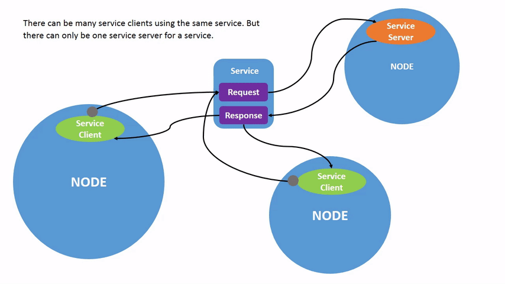
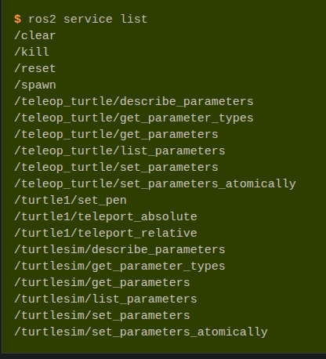
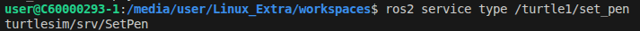
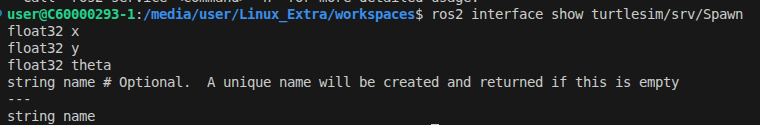
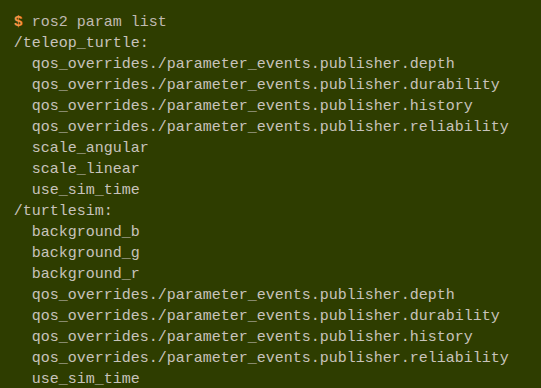
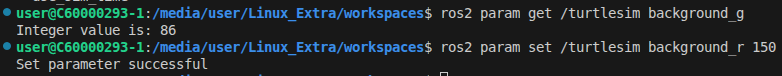

- service 具備request與response
- topic 只有response

cmd
- ros2 service list


- 每個node都有service，且都帶有parameter
- parameter正是基於service所建構
- 

了解service type

- ros2 service find /turtle1/set_pen
- ros2 service info

note:
- ros2 --h
- ros2 service --h

ros2 interface show 


現在您已經了解了什麼是服務類型、如何查找服務類型以及如何查找該類型參數的結構，您可以使用以下方式呼叫服務：

如果你想在座標 (2.0, 2.0) 的位置生成一隻名為 my_turtle 的海龜，角度為 0，你可以使用以下指令：
```
ros2 service call /spawn turtlesim/srv/Spawn "{x: 2.0, y: 2.0, theta: 0.0, name: 'my_turtle'}"
```
```
ros2 service call <service_name> <service_type> <arguments>
```


Summary
- 在 ROS 2 中，節點可以使用服務進行通訊。與主題（單向通訊模式，節點發布資訊供一個或多個訂閱者使用）不同，服務是一種請求/回應模式，客戶端向提供服務的節點發出請求，服務處理請求並產生回應。
- 通常情況下，你不會想使用服務來進行持續呼叫；主題甚至操作會更合適。

# understand parameter
參數是節點的配置值。您可以將參數理解為節點的設定。節點可以將參數儲存為整數、浮點數、布林值、字串和列表。在 ROS 2 中，每個節點都維護自己的參數。

```
ros2 run turtlesim turtlesim_node
```


變更turtlesim(node)的背景顏色


還有更多可設定的parm


在 ROS 2 的實戰中，**「在哪裡設定參數」** 決定了系統的靈活性與維護成本。


### 總結：四種方式的實戰定位

| 方式 | 適合場景 | 使用者是誰 |
| :--- | :--- | :--- |
| **1. CLI (ros2 param set)** | 臨時測試、除錯。 | 工程師 (R&D) |
| **2. Launch 檔案** | **切換產品版本**、啟動多節點組合。 | 系統整合員 (Integrator) |
| **3. 程式碼 (Code)** | 定義參數預設值、處理參數改動後的**邏輯反應**。 | 開發者 (Developer) |
| **4. YAML 檔案** | **儲存大量、複雜的配置**（如 PID、感測器座標）。 | 生產線/佈署人員 (Deployment) |

---

### 具體實戰建議策略：

1.  **硬體/版本參數：** 放在不同的 **YAML** 中，透過 **Launch** 根據 `model_name` 載入。
2.  **演算法參數（如 PID）：** 放在 **YAML** 中，開發期間用 `rqt_reconfigure` (GUI) 線上微調，調好後 `dump` 回 YAML 存檔。
3.  **任務參數（如高度、航點）：** 
    *   由 **App** 透過 `ros2 param set` 或 `Service Call` 發送。
    *   **程式碼** 中必須寫 `add_on_set_parameters_callback`，否則你改了參數，無人機內部變數沒更新，它還是會照舊跑。

**專業 Tip：** 如果是「非常關鍵」且「會頻繁變動」的任務指令（例如：緊急停機、降落），建議使用 **Service (服務)** 或 **Action (動作)** 而不是 Parameter，因為 Service/Action 有「執行回饋」，你可以確定無人機真的收到了指令。


## 使用以下命令將參數從檔案載入到目前正在運行的節點
app:生產線/佈署人員 (Deployment) 
```
ros2 param load /turtlesim turtlesim.yaml
```

若要使用已儲存的參數值啟動節點，請使用：
```
ros2 run <package_name> <executable_name> --ros-args --params-file <file_name>
```

## Summary
節點具有用於定義其預設配置值的參數。您可以透過命令列 get 和 set 參數值。您也可以將參數設定儲存到檔案中，以便在下次會話中重新載入。


# understanding action
