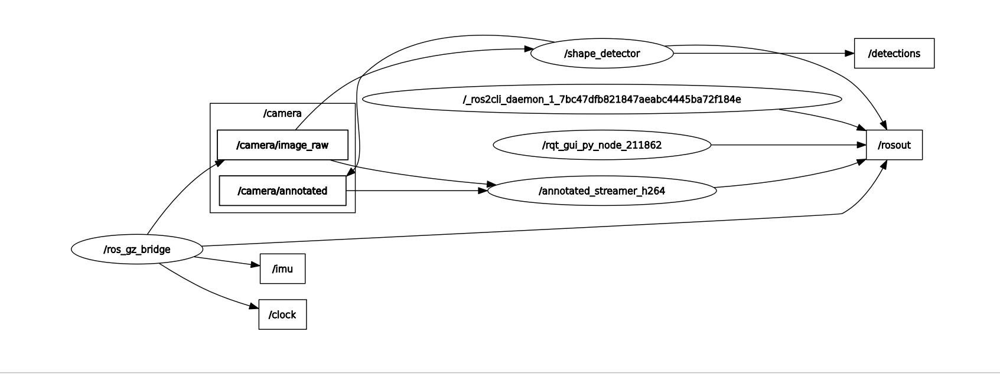

node
topic 

echo topic 

rqt 可視化工具
rqt_graph

## topic flow 

which topic 
who is publisher 
who is subscriber 
what is topic info 
what is topic hz 

源頭：/ros_gz_bridge (最左邊)
它從 Gazebo 模擬器把影像拿出來，發布到 /camera/image_raw 這個話題。
所以它是數據的生產者 (Publisher)。
處理者：/shape_detector (右下角)
它訂閱 (Subscribe) 了 /camera/image_raw。
它對影像進行加工 (畫框框)，然後把結果發布到 /camera/annotated 這個新話題。
終端：/annotated_streamer_h264 (右上角)
它訂閱 了這個加工過的影像 /camera/annotated。
然後把它送去給地面站 (QGC) 看。

- topic info
ROS 是Strongly Typed 的系統。 Publisher 說我要送 Image 格式，Subscriber 就必須用 Image 格式去接。如果您用 String 去接，程式就會報錯，或者根本收不到。

所以寫 ROS 程式的第一步，通常都是先查：「這個 Topic 到底是用什麼 Type？」

練習： 我們來查查看無人機狀態 /mavros/state 是什麼 type？它裡面包了什麼？

- topic hz

QoS Profile 
- Reliability (可靠性): RELIABLE (必達), BEST_EFFORT (盡力)
- Durability (持久性): TRANSIENT_LOCAL (保留歷史), VOLATILE (即時)

## System Topics (隱藏版話題)
這些話題通常被 rqt_graph 隱藏，因為它們是系統基礎設施：

1. **/rosout**: 全域日誌 (Global Log)
   - 所有節點的 print/log 都會匯流到這裡。
   - 工具: `rqt_console` (專門過濾和查看 rosout 的 GUI)
   
2. **/clock**: 模擬時間
   - Gazebo 發送，告訴大家現在模擬世界幾點了。

3. **/parameter_events**: 參數監控
   - 當節點參數被修改時通知。

## rosout
- 所有節點的 print/log 都會匯流到這裡。
- 可以用ros2 topic echo /rosout 來看
- 更厲害的工具：
    - rqt_console (專門過濾和查看 rosout 的 GUI)
    - Foxglove Studio
    - PlotJuggler
    - RViz2 (3D 可視化的標準)
